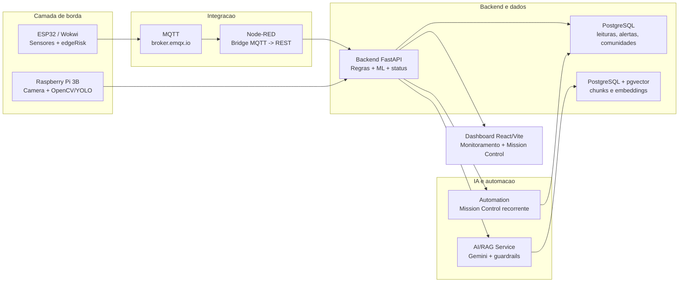
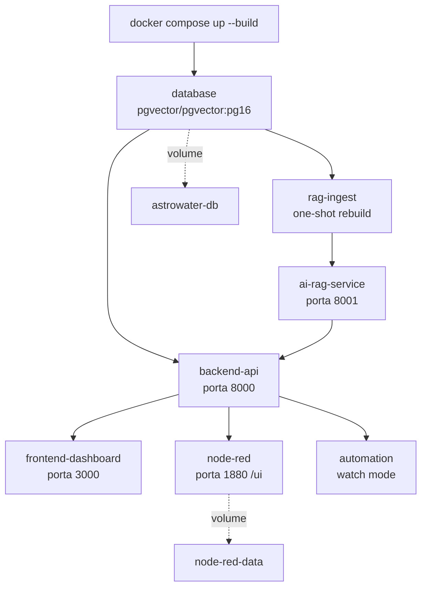
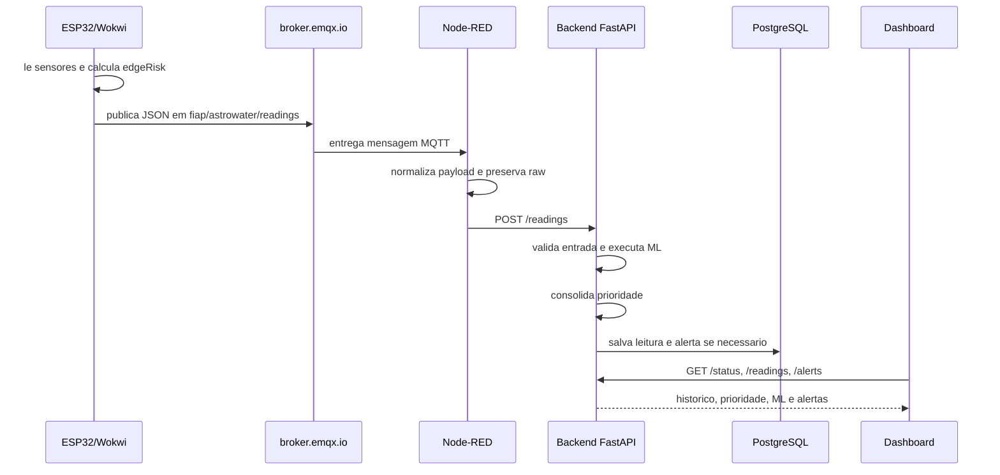
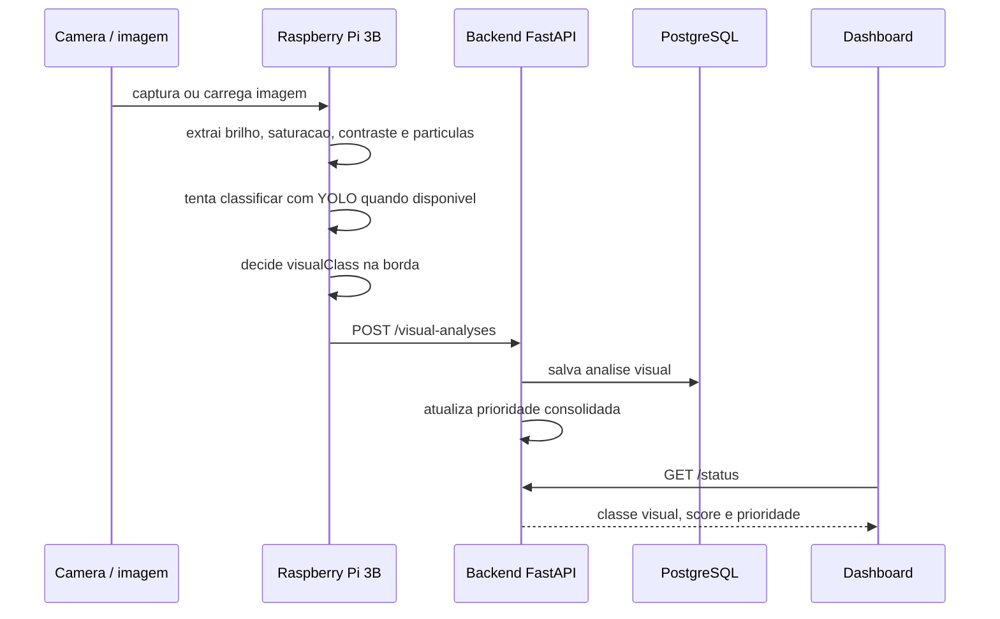
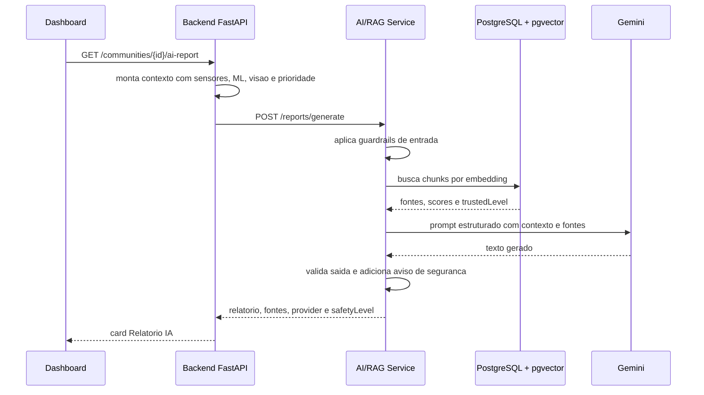
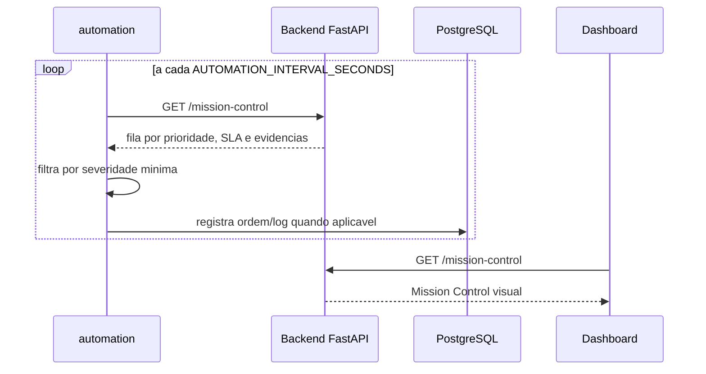
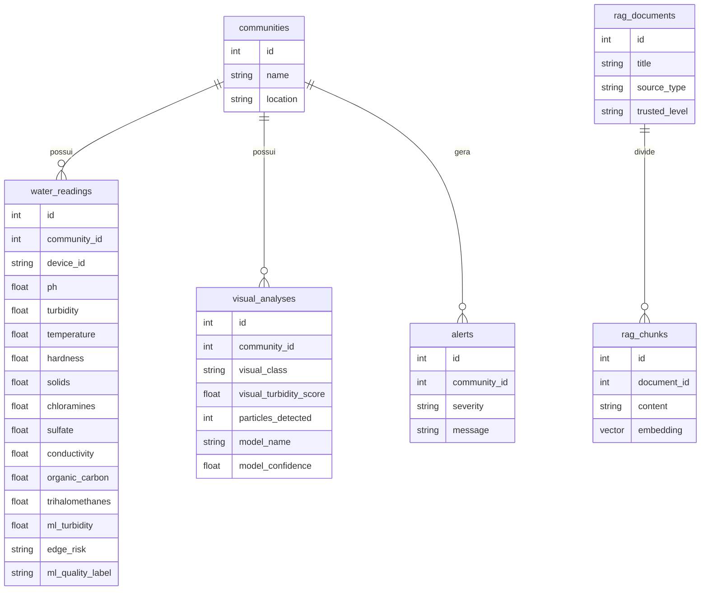

# FIAP - Faculdade de Informática e Administração Paulista

<p align="center">
<a href="https://www.fiap.com.br/">
  
</a>
</p>

<br>

# AstroWater AI

POC da Global Solution 2026.1 para **triagem inteligente de amostras de agua**, inspirada em sistemas de suporte a vida de missoes espaciais. A solucao usa sensores, computacao de borda, visao computacional, Machine Learning, automacao, dashboards, RAG e IA generativa para priorizar comunidades que precisam de verificacao preventiva.

> O AstroWater AI nao declara potabilidade oficial. Ele e uma ferramenta de apoio a triagem e priorizacao. Em caso de risco, a recomendacao e evitar consumo direto e encaminhar a amostra para avaliacao oficial.

### Links importantes

- <a href="https://wokwi.com/projects/432335594961267713">Sensores wokwi https://wokwi.com/projects/432335594961267713</a>
- <a href="#">Video youtube</a>


## Nome do grupo

Rumo ao NEXT

## 👨‍🎓 Integrantes: 
- <a href="#">Felipe Livino dos Santos (RM 563187)</a>
- <a href="#">Daniel Veiga Rodrigues de Faria (RM 561410)</a>
- <a href="#">Tomas Haru Sakugawa Becker (RM 564147)</a>
- <a href="#">Daniel Tavares de Lima Freitas (RM 562625)</a>
- <a href="#">Gabriel Konno Carrozza (RM 564468)</a>

## 👩‍🏫 Professores:
### Tutor(a) 

- <a href="#">Caique Nonato da Silva Bezerra</a>

### Coordenador(a)

- <a href="https://www.linkedin.com/company/inova-fusca">ANDRÉ GODOI CHIOVATO</a>


## Sumario

- [Estrutura de pastas](#estrutura-de-pastas)
- [Proposta](#proposta)
- [Problema](#problema)
- [Como a solucao funciona](#como-a-solucao-funciona)
- [Arquitetura geral](#arquitetura-geral)
- [Fluxos de sequencia](#fluxos-de-sequencia)
- [Status, prioridade e confianca](#status-prioridade-e-confianca)
- [Tecnologias e disciplinas FIAP](#tecnologias-e-disciplinas-fiap)
- [Execucao com Docker Compose](#execucao-com-docker-compose)
- [Como demonstrar](#como-demonstrar)
- [Testes](#testes)
- [Documentacao de entrega](#documentacao-de-entrega)
- [Histórico de lançamentos](#historico-de-lancamentos)
- [Licença](#licenca)


## 📁 Estrutura de pastas

Esta secao funciona como o mapa de entrada do repositorio. Cada pasta principal representa um modulo da POC e possui, quando aplicavel, um README proprio com detalhes internos, comandos e diagramas.

```text
gs1/
├── ai-rag-service/
├── automation/
├── backend-api/
├── data/
├── database/
├── deep-learning/
├── docs/
├── frontend-dashboard/
├── iot-wokwi/
├── machine-learning/
├── node-red/
├── reports/
└── vision-rpi/
```

| Pasta | Modulo | Papel no projeto | README |
| --- | --- | --- | --- |
| `ai-rag-service` | IA generativa, RAG e guardrails | Servico isolado que gera relatorios com Gemini, busca vetorial, embeddings, fontes curadas e protecoes contra prompt injection. | [ai-rag-service/README.md](ai-rag-service/README.md) |
| `automation` | Mission Control recorrente | Rotina periodica que consulta prioridades, organiza fila operacional e demonstra automacao tipo cron job. | [automation/README.md](automation/README.md) |
| `backend-api` | API central e regras de negocio | FastAPI que recebe leituras, salva no banco, executa ML, consolida prioridade, gera alertas, integra RAG e serve dados ao frontend. | [backend-api/README.md](backend-api/README.md) |
| `data` | Dados de apoio e base RAG | Seeds, fontes ouro, textos curados, chunks e arquivos usados para alimentar banco, demonstracao e RAG. | [data/README.md](data/README.md) |
| `database` | Persistencia e estrutura SQL | Scripts de criacao do PostgreSQL, tabelas relacionais, indices e suporte a `pgvector`. | [database/README.md](database/README.md) |
| `deep-learning` | Treinamento visual com YOLO | Notebook e artefatos de Deep Learning para classificar residuos/objetos em agua superficial. | [deep-learning/README.md](deep-learning/README.md) |
| `docs` | Documentacao de entrega | Material PDF. | [docs/README.md](docs/README.md) |
| `frontend-dashboard` | Dashboard principal | Interface React/Vite com monitoramento, historico, perfil ML, visao computacional, relatorio IA, alertas e Mission Control. | [frontend-dashboard/README.md](frontend-dashboard/README.md) |
| `iot-wokwi` | ESP32 simulado e IoT | Firmware e circuito Wokwi com sensores simulados, LCD, LEDs, buzzer, MQTT, fila local e decisao na borda. | [iot-wokwi/README.md](iot-wokwi/README.md) |
| `machine-learning` | Machine Learning tabular | Notebook de treinamento do modelo de potabilidade com EDA, tratamento de dados, comparacao de modelos e exportacao `.joblib`. | [machine-learning/README.md](machine-learning/README.md) |
| `node-red` | Automacao visual MQTT -> REST | Flow Node-RED que assina MQTT, normaliza payload, exibe dashboard `/ui` e encaminha leituras ao backend. | [node-red/README.md](node-red/README.md) |
| `reports` | Resultados e artefatos gerados | Saidas de experimentos, imagens, graficos, metricas e arquivos usados como evidencia tecnica. | [reports/README.md](reports/README.md) |
| `vision-rpi` | Visao computacional em borda | Scripts para Raspberry Pi 3B com camera, OpenCV, YOLO quando possivel, decisao local e envio para o backend. | [vision-rpi/README.md](vision-rpi/README.md) |


‼️ OBSERVAÇÃO DO TUTOR, favor desconsiderar do seu arquivo final: não há obrigação de usar todas as pastas, use apenas o que fizer SENTIDO para a entrega. ‼️


## Proposta

O espaco deixou de ser apenas um territorio cientifico e passou a representar uma fronteira tecnologica, economica e estrategica. Satelites, sondas, rovers e futuras missoes tripuladas dependem de sistemas capazes de monitorar recursos vitais com alta confiabilidade. Entre todos esses recursos, a agua e um dos mais importantes: sem agua nao ha suporte a vida, producao de alimentos, higiene, controle termico ou permanencia humana em ambientes extremos.

Em uma missao para a Lua, Marte, Europa ou outro corpo celeste, a agua precisa ser monitorada continuamente. Uma sonda automatica, uma base lunar ou uma viagem interplanetaria nao pode depender apenas de verificacoes manuais tardias. O sistema precisa coletar dados, tomar decisoes na borda, economizar comunicacao, gerar alertas, manter historico e orientar a equipe de operacao. Essa mesma logica tambem faz sentido na Terra, principalmente em comunidades ribeirinhas, rurais, abrigos temporarios e regioes isoladas.

O **AstroWater AI** aplica essa visao de missao critica na Terra. A POC usa IA, automacao, IoT, Edge Computing, visao computacional, Machine Learning, RAG e dashboards para apoiar a triagem de amostras de agua. O foco nao e substituir laboratorio; o foco e indicar, com rapidez e rastreabilidade:

> Quais amostras de agua precisam ser verificadas primeiro?

Essa abordagem tambem se conecta com a economia espacial porque mostra como tecnologias originalmente associadas ao espaco podem gerar impacto social direto. Um exemplo real e a India: a ISRO usa sensoriamento remoto por satelite em agricultura, solos, previsao de producao de safras e observacao da Terra, mostrando como infraestrutura espacial pode apoiar seguranca alimentar, planejamento e desenvolvimento social. O AstroWater AI segue essa mesma ideia em escala de POC: usar tecnologia inspirada no setor espacial para proteger um recurso essencial a vida humana.


## Problema

Monitorar agua e uma atividade de missao critica. Em ambientes espaciais, uma falha na qualidade da agua pode comprometer uma tripulacao, uma estufa experimental, um sistema de suporte a vida ou uma missao robotica de longa duracao. Na Terra, o problema tambem e grave: comunidades afastadas podem demorar para perceber alteracoes na agua consumida, especialmente quando nao ha laboratorio proximo, conectividade constante ou equipe tecnica disponivel.

Turbidez elevada, sedimentos visiveis, pH fora da faixa, falhas de leitura ou ausencia de monitoramento podem atrasar uma resposta preventiva. O resultado e que a comunidade pode continuar usando uma fonte que deveria ser isolada, acompanhada ou encaminhada para analise oficial.

O desafio do AstroWater AI e criar uma camada tecnologica inicial que responda rapido, mesmo com recursos limitados:

- **na borda**, sensores e camera fazem uma primeira leitura local;
- **na comunicacao**, MQTT permite enviar telemetria de forma leve;
- **no backend**, regras, historico e Machine Learning consolidam a prioridade;
- **na IA**, RAG e guardrails explicam a situacao com base em fontes e limites de seguranca;
- **na operacao**, Mission Control organiza o que precisa ser verificado primeiro.

O AstroWater AI resolve esse problema como uma camada de **triagem tecnologica inicial**:

- coleta sinais de sensores;
- analisa imagem da agua na borda;
- estima perfil quimico por Machine Learning;
- consolida prioridade no backend;
- registra historico e alertas;
- gera relatorio de IA com fontes e guardrails;
- organiza uma fila operacional de Mission Control.

## Como a solucao funciona

1. O **ESP32 simulado no Wokwi** mede pH, turbidez, temperatura e parametros fisico-quimicos usados pelo modelo de ML.
2. O ESP32 calcula uma prioridade local (`edgeRisk`), mostra no LCD/LEDs/buzzer e publica a leitura via MQTT.
3. O **Node-RED** assina o topico MQTT, normaliza o payload e envia ao backend.
4. O **Raspberry Pi 3B com camera** analisa uma imagem da agua na borda usando OpenCV e, quando viavel, modelo YOLO treinado.
5. O **backend FastAPI** salva leituras, roda o modelo de ML, consolida prioridade e gera alertas.
6. O **PostgreSQL** guarda historico, comunidades, alertas e base vetorial RAG com `pgvector`.
7. O **dashboard React/Vite** mostra monitoramento, historico, perfil ML, visao computacional, alertas e relatorio IA.
8. O **AI/RAG Service** usa Gemini, embeddings, fontes curadas e guardrails para gerar relatorios.
9. O modulo **automation** roda de tempos em tempos e transforma prioridade em fila operacional de Mission Control.

## Arquitetura geral



### Leitura da arquitetura

A arquitetura foi desenhada em camadas para demonstrar uma solucao proxima de um cenario real de monitoramento remoto: a borda coleta e decide rapidamente, a integracao transporta os dados, o backend consolida as regras de negocio, o banco preserva historico e a IA gera apoio a decisao com base em evidencias.

| Bloco | O que faz | Por que foi escolhido |
| --- | --- | --- |
| **ESP32 / Wokwi** | Simula a unidade embarcada de campo. Le pH, turbidez, temperatura e parametros fisico-quimicos usados pelo modelo de Machine Learning. Tambem calcula um `edgeRisk`, aciona LCD, LEDs e buzzer, e usa fila local quando a rede esta desligada. | Representa IoT e Edge Computing. Mesmo sendo uma simulacao, permite demonstrar sensores, comunicacao, falha de rede, cache local e decisao na borda sem depender de hardware fisico para todos os integrantes. |
| **Raspberry Pi 3B + camera** | Atua como ponto de visao computacional. Captura ou recebe imagem da agua, calcula heuristicas visuais com OpenCV e tenta usar o modelo treinado para reconhecer indicios de residuos ou sedimentos. | Mostra computacao de borda real. A decisao visual acontece antes de enviar ao servidor, reduzindo dependencia de nuvem e conectando o projeto ao conceito de sistemas autonomos em ambientes extremos. |
| **MQTT / broker.emqx.io** | Transporta as leituras do ESP32 para a camada de integracao. | MQTT e leve, assincrono e comum em IoT. Para dispositivos embarcados, e mais adequado do que fazer chamadas HTTP diretas a cada leitura, porque reduz acoplamento e consumo de comunicacao. |
| **Node-RED** | Assina o topico MQTT, normaliza o payload recebido do Wokwi, exibe dados em `/ui` e encaminha a leitura para o backend. | Funciona como ponte de automacao e integracao. Facilita demonstrar visualmente o fluxo IoT, alem de separar a chegada MQTT da API principal. |
| **Backend FastAPI** | Recebe leituras e analises visuais, valida dados, executa o modelo de ML, calcula prioridade consolidada, gera alertas, serve o dashboard e integra com o servico RAG. | Centraliza as regras de negocio. Essa separacao evita que o frontend ou o Node-RED tenham logica critica espalhada, deixando a decisao rastreavel e testavel. |
| **PostgreSQL** | Guarda comunidades, leituras, parametros de ML, alertas, analises visuais, relatorios e eventos de automacao. | Banco relacional e adequado para historico, consultas, auditoria e integridade dos dados. Ajuda o avaliador a ver que a POC nao e apenas tela, mas tem persistencia real. |
| **PostgreSQL + pgvector** | Armazena chunks da base de conhecimento e embeddings usados pelo RAG. | Como o projeto ja usa PostgreSQL, o `pgvector` evita criar mais uma ferramenta externa. Isso simplifica o Docker Compose e demonstra busca vetorial com arquitetura enxuta. |
| **AI/RAG Service** | Gera relatorios com Gemini, recupera fontes da base vetorial e aplica guardrails contra prompt injection e respostas fora do escopo. | Foi separado do backend para isolar a parte generativa. Isso facilita evoluir o modelo, trocar provider ou ajustar prompts sem alterar a API principal. |
| **Automation / Mission Control** | Roda periodicamente, consulta prioridades e alertas, e monta uma fila operacional de verificacoes. | Representa automacao recorrente, como um centro de operacoes. Em vez de apenas mostrar dados, o sistema transforma leituras em tarefas de acompanhamento. |
| **Dashboard React/Vite** | Mostra monitoramento, historico, ML, visao computacional, relatorio IA, alertas e Mission Control. | E a camada de comunicacao visual. Ajuda a apresentar a POC de forma clara para avaliadores, conectando dados tecnicos a uma narrativa de tomada de decisao. |

### Por que a arquitetura esta dividida assim?

- **Baixo acoplamento:** o ESP32 publica em MQTT e nao precisa conhecer diretamente o backend. Se a API estiver fora do ar, a fila local e o broker reduzem perda de dados.
- **Decisao na borda:** tanto o Wokwi quanto o Raspberry Pi fazem pre-processamento antes do servidor. Isso reforca Edge Computing, economia de transmissao e autonomia.
- **Backend como fonte da verdade:** o backend calcula a prioridade final usando sensores, ML e visao computacional. Assim, o dashboard apenas apresenta o resultado e nao decide sozinho.
- **Dados persistidos:** PostgreSQL permite historico, estatisticas, alertas, relatorios e demonstracao de consultas reais.
- **RAG separado:** a IA generativa fica em um modulo proprio, com embeddings, fontes e guardrails. Isso deixa claro que o relatorio nao e uma resposta solta do modelo, mas uma sintese controlada e baseada em contexto.
- **Automacao operacional:** o modulo de Mission Control mostra que o sistema pode rodar de tempos em tempos, priorizando comunidades que precisam de nova leitura, captura visual ou avaliacao oficial.

### Caminho principal dos dados

1. O ESP32/Wokwi coleta parametros e publica via MQTT.
2. O Node-RED recebe, transforma e envia ao backend.
3. O backend valida, salva e executa o modelo de Machine Learning.
4. O Raspberry Pi envia uma analise visual independente quando ha imagem.
5. O backend consolida sensores, ML e visao em uma prioridade unica.
6. O dashboard consulta a API para exibir status, graficos e alertas.
7. O servico RAG usa os dados consolidados e a base vetorial para gerar relatorio explicavel.
8. A automacao consulta periodicamente o backend/banco e atualiza a fila de Mission Control.

## Arquitetura de containers



### Leitura da arquitetura de containers

O `docker-compose.yml` foi organizado para que se consiga subir praticamente toda a plataforma com um unico comando. A excecao natural e a borda fisica, porque o Wokwi roda fora do Docker e o Raspberry Pi executa o script localmente no proprio dispositivo.

| Container | Responsabilidade | Por que roda separado |
| --- | --- | --- |
| **database** | Sobe PostgreSQL com suporte a `pgvector`, cria tabelas, extensoes e estrutura inicial. | E a fundacao de persistencia do projeto. Todos os modulos que precisam de historico, alertas ou base vetorial dependem dele. |
| **rag-ingest** | Executa uma carga inicial one-shot da base de conhecimento RAG, gerando chunks e embeddings no banco. | Foi separado porque ingestao nao precisa ficar rodando para sempre. Ela prepara o ambiente e encerra, deixando o servico de IA mais leve. |
| **ai-rag-service** | Mantem a API de IA generativa, busca vetorial, prompt engineering e guardrails. | Isola a parte de IA do backend principal. Assim, uma falha ou troca de modelo generativo nao quebra a API de sensores. |
| **backend-api** | Expoe a API principal em `localhost:8000`, recebe leituras, executa ML, calcula prioridade, salva alertas e serve dados ao frontend. | E o nucleo da aplicacao. Ele concentra as regras de negocio e evita logica duplicada no dashboard, Node-RED ou automacao. |
| **frontend-dashboard** | Serve a interface em `localhost:3000`. | O frontend fica separado para evoluir visualmente sem alterar API, banco ou automacoes. |
| **node-red** | Sobe o editor e o dashboard Node-RED em `localhost:1880` e `/ui`, fazendo a ponte MQTT -> REST. | Demonstra automacao visual e integracao IoT, alem de deixar transparente como a mensagem MQTT chega ao backend. |
| **automation** | Executa a rotina recorrente de Mission Control em modo continuo. | Mostra comportamento de cron job/monitoramento operacional, transformando dados em fila de acao. |

O Compose tambem usa volumes para manter dados importantes entre execucoes:

- **Volume do PostgreSQL:** preserva tabelas, historico, embeddings e alertas.
- **Volume do Node-RED:** preserva flows, configuracoes do dashboard `/ui` e estado do editor.

Essa divisao facilita a apresentacao porque cada parte tem uma responsabilidade clara. Se algo falhar, fica mais simples explicar, testar e reiniciar apenas o modulo afetado.

## Fluxos de sequencia

### 1. Telemetria do ESP32/Wokwi ate o dashboard



#### Leitura do fluxo

Esse fluxo mostra como uma leitura simulada no ESP32 vira informacao operacional no dashboard.

| Etapa | O que acontece | Por que e importante |
| --- | --- | --- |
| **Leitura local** | O ESP32/Wokwi le potenciometros e sensores simulados, calcula pH, turbidez, temperatura e parametros usados pelo modelo de ML. | Demonstra a camada embarcada e torna visivel que os dados nao nascem no backend. |
| **Decisao na borda** | O firmware calcula `edgeRisk`, atualiza LCD, LEDs e buzzer, e usa fila local quando a rede esta OFF. | Mostra Edge Computing: o dispositivo consegue reagir mesmo antes do servidor receber a leitura. |
| **Publicacao MQTT** | O ESP32 publica um JSON no topico `fiap/astrowater/readings`. | MQTT reduz acoplamento e simula um padrao real de telemetria IoT. |
| **Node-RED** | O Node-RED assina o topico, normaliza campos, mostra os parametros no `/ui` e envia ao backend via REST. | Serve como camada visual de integracao e facilita demonstrar o caminho dos dados durante o video. |
| **Backend** | A API valida o payload, salva a leitura, executa o modelo tabular, calcula prioridade final e cria alerta se necessario. | Centraliza regra de negocio e garante que a interface mostre uma decisao consistente. |
| **Dashboard** | O React consulta `/status`, `/readings` e `/alerts` para montar cards, historico, estatisticas e alertas. | Transforma telemetria tecnica em uma visao facil de entender para tomada de decisao. |

Na apresentacao, esse fluxo e bom para demonstrar a parte de sensores, fila local, MQTT, Node-RED, banco, ML e dashboard em uma unica narrativa.

### 2. Visao computacional no Raspberry Pi



#### Leitura do fluxo

Esse fluxo demonstra a computacao de borda fisica usando o Raspberry Pi 3B com camera.

| Etapa | O que acontece | Por que e importante |
| --- | --- | --- |
| **Captura da imagem** | O Raspberry Pi recebe uma imagem existente ou captura uma foto da amostra de agua. | Permite demonstrar uma fonte de dados diferente dos sensores numericos. |
| **Pre-processamento OpenCV** | O script calcula brilho, saturacao, contraste, tonalidade, textura visual e particulas aparentes. | Garante que a borda produza evidencias mesmo quando o modelo de Deep Learning for pesado para o Raspberry Pi. |
| **Modelo YOLO quando disponivel** | O script tenta usar o modelo treinado para auxiliar a classificacao visual. | Mostra Deep Learning aplicado, mas com degradacao controlada caso o hardware limitado nao consiga rodar bem. |
| **Decisao visual na borda** | O Raspberry classifica a amostra como clara, turva, com sedimentos ou suspeita, antes de enviar ao servidor. | Reforca a ideia de autonomia em ambiente extremo, onde conexao e energia podem ser limitadas. |
| **Envio ao backend** | O resultado e enviado para `/visual-analyses` com classe, score, particulas, confianca e metadados. | O backend recebe uma decisao pronta da borda, nao apenas uma imagem bruta. |
| **Consolidacao no dashboard** | A API salva o resultado e o frontend mostra o card de visao computacional junto dos sensores. | Une camera e sensores em uma unica prioridade de triagem. |

O ponto forte aqui e explicar que o Raspberry Pi nao foi usado como "camera burra". Ele participa da decisao, o que aproxima a POC de sistemas autonomos de exploracao, monitoramento remoto e suporte a vida.

### 3. Relatorio IA com RAG, embeddings e guardrails



#### Leitura do fluxo

Esse fluxo mostra como a IA generativa entra como apoio a decisao, sem virar uma resposta livre e sem controle.

| Etapa | O que acontece | Por que e importante |
| --- | --- | --- |
| **Pedido do dashboard** | O frontend pede um relatorio para a comunidade selecionada. | O relatorio nasce a partir de uma acao ou estado real da aplicacao, nao de um prompt solto. |
| **Contexto no backend** | A API monta um contexto com sensores recentes, resultado do ML, visao computacional, prioridade e alertas. | Faz o modelo responder sobre a situacao real registrada no sistema. |
| **Guardrails de entrada** | O AI/RAG Service valida o pedido, escopo e possiveis tentativas de prompt injection. | Demonstra IA segura e evita que o usuario force o modelo a ignorar regras ou sair do dominio. |
| **Busca vetorial com pgvector** | O servico consulta chunks de conhecimento por similaridade de embeddings. | Garante que a resposta use fontes do projeto e materiais curados, nao apenas conhecimento generico do modelo. |
| **Prompt estruturado** | O Gemini recebe contexto, fontes, limites de seguranca e formato esperado. | Aplica Prompt Engineering com objetivo claro, reduzindo alucinacao e melhorando padronizacao. |
| **Guardrails de saida** | O texto gerado e revisado para incluir aviso de seguranca e nao declarar potabilidade oficial. | Mantem a POC responsavel: ela orienta triagem, mas nao substitui laboratorio ou vigilancia sanitaria. |
| **Exibicao no frontend** | O dashboard mostra relatorio, fontes, `provider`, `safetyLevel` e origem das evidencias. | Ajuda a enxergar RAG, embeddings, fontes e governanca de IA funcionando na interface. |

Esse desenho deixa claro que a IA generativa nao decide sozinha. Ela resume e explica evidencias produzidas por sensores, ML, visao computacional e regras do backend.

### 4. Automacao Mission Control



#### Leitura do fluxo

Esse fluxo mostra a parte de automacao recorrente do projeto. A ideia e simular um centro de operacoes que verifica periodicamente quais comunidades precisam de atencao.

| Etapa | O que acontece | Por que e importante |
| --- | --- | --- |
| **Execucao recorrente** | O container `automation` roda em loop usando `AUTOMATION_INTERVAL_SECONDS`. | Atende a ideia de cron job/automacao periodica, sem depender de alguem clicar no dashboard. |
| **Consulta ao Mission Control** | A automacao chama a API para obter comunidades, prioridades, SLA, evidencias e alertas. | O trabalho operacional nasce dos dados reais consolidados pelo backend. |
| **Filtro por severidade** | O modulo aplica severidade minima para destacar o que precisa de acao primeiro. | Evita gerar ruido operacional e reforca a proposta de priorizacao. |
| **Registro de execucao** | Quando aplicavel, a automacao registra eventos/logs no banco. | Cria rastreabilidade para mostrar que a rotina rodou e quais decisoes foram avaliadas. |
| **Visualizacao no frontend** | A aba Mission Control mostra a fila, motivos, evidencias e proximas acoes. | Torna a automacao facil de entender visualmente, algo importante para a banca da FIAP. |

Essa automacao conecta bem com o tema espacial porque lembra operacao de missao: o sistema monitora dados continuamente, destaca prioridades e orienta proximas verificacoes sem depender de acompanhamento manual constante.


### Leitura rapida dos modulos

- **Borda e sensores:** `iot-wokwi` e `vision-rpi`.
- **Integracao e automacao visual:** `node-red`.
- **Nucleo da aplicacao:** `backend-api`, `database` e `data`.
- **Modelos de IA:** `machine-learning`, `deep-learning` e `ai-rag-service`.
- **Operacao e apresentacao:** `automation`, `frontend-dashboard`, `docs` e `reports`.

## Mapa de dados



### Leitura do mapa de dados

O mapa de dados mostra como o sistema guarda informacoes de monitoramento, visao computacional, alertas e conhecimento usado pela IA. A ideia principal e simples: **cada comunidade tem um historico de leituras, pode receber analises visuais, pode gerar alertas e pode ser explicada pelo RAG usando uma base de conhecimento vetorial**.

| Entidade | O que representa | Como e usada no projeto |
| --- | --- | --- |
| **communities** | Comunidades monitoradas pela POC, como Comunidade Aurora, Horizonte e Vega. | E o ponto central do sistema. Leituras, imagens e alertas sempre ficam associados a uma comunidade. |
| **water_readings** | Leituras enviadas pelo ESP32/Wokwi via MQTT e Node-RED. | Guarda pH, turbidez, temperatura e parametros fisico-quimicos usados pelo modelo de ML. Tambem salva o risco calculado na borda e o resultado auxiliar do modelo. |
| **visual_analyses** | Resultados enviados pelo Raspberry Pi depois da analise de imagem. | Guarda classe visual, score de turbidez, particulas detectadas, nome do modelo e confianca. Esses dados ajudam a confirmar ou elevar a prioridade da comunidade. |
| **alerts** | Alertas criados quando alguma regra indica atencao, alta prioridade ou risco critico. | Alimenta o card de alertas do dashboard e a fila de Mission Control. |
| **rag_documents** | Documentos da base de conhecimento, incluindo fontes internas do projeto e fontes ouro. | Servem como origem confiavel para o RAG. Cada documento tem metadados como titulo, tipo de fonte e nivel de confianca. |
| **rag_chunks** | Pedacos menores dos documentos, ja preparados para busca vetorial. | Cada chunk tem um embedding. Quando o relatorio IA e gerado, o sistema busca os chunks mais parecidos com o contexto da comunidade. |

### Como os dados se conectam na pratica

1. A tabela `communities` define quem esta sendo monitorado.
2. Cada leitura do ESP32 entra em `water_readings` vinculada a uma comunidade.
3. Cada imagem analisada no Raspberry Pi entra em `visual_analyses` tambem vinculada a uma comunidade.
4. O backend cruza leituras, ML e visao computacional para calcular a prioridade.
5. Se a prioridade exige atencao, o backend registra um item em `alerts`.
6. O dashboard consulta essas tabelas para mostrar historico, cards, graficos e alertas.
7. O RAG usa `rag_documents` e `rag_chunks` para gerar relatorios com fontes, sem depender apenas da memoria do modelo generativo.

Esse modelo foi escolhido porque separa bem os tipos de dado. Sensor numerico fica em uma tabela, analise visual fica em outra, alerta fica em outra e conhecimento da IA fica separado em tabelas vetoriais. Isso facilita explicar o projeto, consultar historico e evoluir cada modulo sem misturar responsabilidades.

## Status, prioridade e confianca

O AstroWater AI separa **prioridade final de triagem** do **perfil quimico estimado por ML**.

- A prioridade final orienta dashboard, alertas e Mission Control.
- O ML tabular e uma evidencia auxiliar.
- A IA generativa explica o resultado, mas nao substitui avaliacao oficial.

### Prioridade de triagem

| Codigo interno | Nome exibido | Significado | Acao recomendada |
| --- | --- | --- | --- |
| `verde` | Rotina | Sem sinais criticos imediatos nos dados recebidos. | Manter monitoramento. |
| `amarelo` | Atencao | Dado ausente ou fora da faixa ideal, sem indicio critico isolado. | Acompanhar e medir novamente. |
| `laranja` | Alta | Sinal elevado, como turbidez intermediaria ou classe visual suspeita. | Priorizar verificacao preventiva. |
| `vermelho` | Critica | Sinal critico, como pH extremo, turbidez muito alta ou sedimentos. | Evitar consumo direto e acionar avaliacao oficial. |

Regras principais:

- pH menor que `6.0` ou maior que `9.0`: `vermelho`.
- pH entre `6.0` e `6.5`, ou entre `8.5` e `9.0`: `amarelo`.
- turbidez ate `5 NTU`: `verde`.
- turbidez acima de `5` ate `25 NTU`: `amarelo`.
- turbidez acima de `25` ate `50 NTU`: `laranja`.
- turbidez acima de `50 NTU`: `vermelho`.
- temperatura abaixo de `5C` ou acima de `30C`: `amarelo`.
- temperatura acima de `35C`: `laranja`.
- visual `transparente` ou `limpa`: `verde`.
- visual `azulada`: `amarelo`.
- visual `turva` ou `amarelada`: `laranja`.
- visual `com sedimentos`: `vermelho`.

Quando mais de uma evidencia aparece, o backend consolida de forma conservadora. Duas evidencias de atencao podem elevar para `laranja`; uma evidencia `laranja` somada a outra de atencao pode elevar para `vermelho`.

### Perfil quimico ML

O modelo tabular usa os parametros do dataset `water_potability`:

`ph`, `Hardness`, `Solids`, `Chloramines`, `Sulfate`, `Conductivity`, `Organic_carbon`, `Trihalomethanes` e `Turbidity`.

| `mlQualityLabel` | Nome exibido | Significado |
| --- | --- | --- |
| `potavel` | Sem alerta ML | Perfil compativel com potabilidade no dataset. |
| `nao_potavel` | Alerta ML | Perfil nao compativel com potabilidade no dataset. |
| `baixa_confianca` | Inconclusivo | Probabilidade abaixo de `0.65`; o sistema nao assume decisao forte. |
| `dados_insuficientes` | Dados insuf. | Faltam parametros obrigatorios. |
| `modelo_indisponivel` | Modelo off | Arquivo do modelo nao esta disponivel. |
| `erro_inferencia` | Erro ML | Falha ao executar inferencia. |

## Tecnologias e disciplinas FIAP

| Area | Como aparece no projeto |
| --- | --- |
| IA Generativa | Relatorios com Gemini via AI/RAG Service. |
| RAG | Fontes curadas, chunks, embeddings, pgvector e fontes recuperadas. |
| Prompt Engineering | Prompt estruturado para relatorio e perguntas. |
| Guardrails | Bloqueio de prompt injection, segredo e resposta insegura sobre agua. |
| Machine Learning | Modelo tabular de potabilidade integrado ao backend. |
| Deep Learning | Notebook YOLO para classificacao visual de residuos. |
| Visao Computacional | Raspberry Pi + OpenCV + decisao visual na borda. |
| ESP32 / IoT | Wokwi com sensores, LCD, LEDs, buzzer, MQTT e fila local. |
| Edge/Fog Computing | ESP32 e Raspberry Pi tomam decisoes antes do backend. |
| Automacao | Mission Control recorrente em Python. |
| APIs REST | FastAPI com endpoints para leituras, status, alertas, RAG e Mission Control. |
| Dashboard | React/Vite com tema espacial e visualizacao operacional. |
| Dados / Banco | PostgreSQL, pgvector, seeds, historico e metricas. |
| Docker | Compose orquestra banco, backend, frontend, RAG, Node-RED e automacao. |

## Execucao com Docker Compose

Copie `.env.example` para `.env` e ajuste as variaveis quando necessario.

```bash
docker compose up -d --build
```

Em uma maquina nova, o Compose prepara a infraestrutura:

- `database` cria tabelas principais e tabelas vetoriais;
- `rag-ingest` roda uma vez, converte `data/rag_sources` em chunks e salva embeddings no PostgreSQL;
- `ai-rag-service` sobe depois da ingestao vetorial;
- `backend-api` sobe depois do banco saudavel e do servico de IA;
- `automation` sobe em modo recorrente;
- `frontend-dashboard` e `node-red` ficam prontos para demonstracao.

Servicos esperados:

| Servico | URL |
| --- | --- |
| Dashboard principal | `http://localhost:3000` |
| Backend API | `http://localhost:8000` |
| AI/RAG Service | `http://localhost:8001` |
| Node-RED editor | `http://localhost:1880` |
| Node-RED Dashboard | `http://localhost:1880/ui` |
| PostgreSQL | `localhost:5432` |

Para acompanhar a inicializacao:

```bash
docker compose logs -f rag-ingest ai-rag-service backend-api automation
```

Para recriar tudo do zero em desenvolvimento:

```bash
docker compose down -v
docker compose up -d --build
```

## Variaveis importantes

| Variavel | Uso |
| --- | --- |
| `GEMINI_API_KEY` | Chave do Google AI Studio. |
| `GEMINI_MODEL` | Modelo generativo. Padrao: `gemini-3.1-flash-lite`. |
| `GEMINI_EMBEDDING_MODEL` | Modelo de embeddings. Padrao: `gemini-embedding-001`. |
| `DATABASE_URL` | Conexao PostgreSQL. |
| `AI_RAG_BASE_URL` | URL interna do AI/RAG Service para o backend. |
| `AI_RAG_TIMEOUT_SECONDS` | Tempo maximo que o backend aguarda o AI/RAG Service. Padrao: `60`. |
| `AUTOMATION_INTERVAL_SECONDS` | Intervalo do Mission Control recorrente. |
| `ALERT_MIN_SEVERITY` | Severidade minima da automacao. |

## Execucao local por modulo

### Backend

```bash
cd backend-api
pip install -r requirements.txt
uvicorn src.main:app --reload --port 8000
```

### Dashboard

```bash
cd frontend-dashboard
npm install
npm run build
npm run preview -- --host 127.0.0.1 --port 3001
```

### IA/RAG

```bash
cd ai-rag-service
pip install -r requirements.txt
uvicorn src.main:app --reload --port 8001
```

### Visao computacional

```bash
python vision-rpi/src/generate_samples.py
python vision-rpi/src/analyze_sample.py --image vision-rpi/captures/samples/turva.png --community-id 1
```

### Automacao

```bash
python automation/src/main.py --mode once --backend-url http://localhost:8000
```

### Node-RED

```bash
docker compose up -d --build node-red
```

Depois acesse:

- editor: `http://localhost:1880`
- dashboard visual: `http://localhost:1880/ui`

## Wokwi

O modulo `iot-wokwi` roda no simulador Wokwi.

Arquivos principais:

- `iot-wokwi/sketch.ino`
- `iot-wokwi/diagram.json`
- `iot-wokwi/libraries.txt`

O firmware imprime JSON no Serial Monitor a cada 5 segundos e publica em:

```text
broker.emqx.io / fiap/astrowater/readings
```

O slide switch simula rede:

- `ON`: conecta WiFi/MQTT e sincroniza a fila.
- `OFF`: armazena medicoes no ring buffer local.

## Raspberry Pi

O modulo `vision-rpi` pode rodar diretamente no Raspberry Pi 3B para acessar a camera fisica:

```bash
python vision-rpi/src/analyze_sample.py \
  --capture \
  --output vision-rpi/captures/latest.jpg \
  --community-id 1 \
  --backend-url http://SEU_BACKEND:8000
```

Como o Raspberry Pi 3B tem pouca RAM, o modulo documenta dois modos:

- YOLO/Deep Learning quando o ambiente suportar PyTorch/Ultralytics;
- OpenCV fallback para manter decisao visual de borda com menos custo.

## Como demonstrar

Roteiro sugerido para avaliacao:

1. Abrir o dashboard em `http://localhost:3000`.
2. Mostrar a arquitetura no README.
3. Abrir Wokwi e alterar pH/turbidez para mudar LEDs/LCD/Serial.
4. Mostrar o Node-RED recebendo MQTT e preenchendo `/ui`.
5. Mostrar o backend recebendo leituras e o dashboard atualizando.
6. Rodar uma analise visual no Raspberry Pi ou por imagem local.
7. Mostrar o card de visao computacional no dashboard.
8. Mostrar o Relatorio IA com fontes, `pgvector` e `safetyLevel`.
9. Mostrar a aba Mission Control.
10. Citar que a solucao e triagem e nao laudo oficial.

## Testes

```bash
python -m unittest discover -s backend-api/tests
python -m unittest discover -s ai-rag-service/tests
python -m unittest discover -s vision-rpi/tests
python -m unittest discover -s automation/tests
docker compose config
```

## Documentacao de entrega

- Documento Word base do PDF: [docs/AstroWater_AI_documento_entrega.docx](docs/AstroWater_AI_documento_entrega.docx)
- Documento-base em Markdown: [docs/pdf-entrega.md](docs/pdf-entrega.md)
- Roteiro do video: [docs/roteiro-video.md](docs/roteiro-video.md)
- Checklist de entrega: [docs/checklist-entrega.md](docs/checklist-entrega.md)
- Arquitetura: [docs/arquitetura.md](docs/arquitetura.md)
- Disciplinas: [docs/disciplinas.md](docs/disciplinas.md)
- Governanca de IA: [docs/governanca-ia-segura.md](docs/governanca-ia-segura.md)
- Planejamento completo: [doc/astrowater_ai_disciplinas_e_tarefas.md](doc/astrowater_ai_disciplinas_e_tarefas.md)

## Pontos fortes para a GS

- Integra o maximo de disciplinas das Fases 3 e 4 em uma POC unica.
- Usa problema humano real na Terra com conexao clara com economia espacial.
- Demonstra sensores, Edge Computing, MQTT, dashboard, banco e automacao.
- Inclui ML tabular, Deep Learning em notebook e visao computacional na borda.
- Usa IA generativa com RAG, embeddings, pgvector e guardrails.
- Possui arquitetura distribuida com Docker Compose.
- Tem boa forca visual para video: Wokwi, Node-RED, dashboard espacial, RPi e Relatorio IA.

## Limites e evolucao futura

Esta POC nao substitui analise oficial. Evolucoes possiveis:

- sensores fisicos reais de pH e turbidez;
- comunicacao LoRa para campo;
- aplicativo mobile em React Native;
- modelo de Deep Learning mais leve para Raspberry Pi;
- integracao com orgaos oficiais de vigilancia sanitaria;
- painel de auditoria para historico de decisoes.

## Aviso importante

O AstroWater AI e uma ferramenta de apoio a triagem e priorizacao. Ele nao declara potabilidade oficial e nao substitui laboratorio, vigilancia sanitaria ou profissional responsavel.


## 🗃 Histórico de lançamentos

* 0.5.0 - XX/XX/2024
    * 
* 0.4.0 - XX/XX/2024
    * 
* 0.3.0 - XX/XX/2024
    * 
* 0.2.0 - XX/XX/2024
    * 
* 0.1.0 - XX/XX/2024
    *

---


## 📋 Licença

<p xmlns:cc="http://creativecommons.org/ns#" xmlns:dct="http://purl.org/dc/terms/"><a property="dct:title" rel="cc:attributionURL" href="https://github.com/SabrinaOtoni/TEMPLATE-FIAP-GRAD-ON-IA">MODELO GIT FIAP</a> por <a rel="cc:attributionURL dct:creator" property="cc:attributionName" href="https://fiap.com.br">FIAP</a> está licenciado sobre <a href="http://creativecommons.org/licenses/by/4.0/?ref=chooser-v1" target="_blank" rel="license noopener noreferrer" style="display:inline-block;">Attribution 4.0 International</a>.</p>
