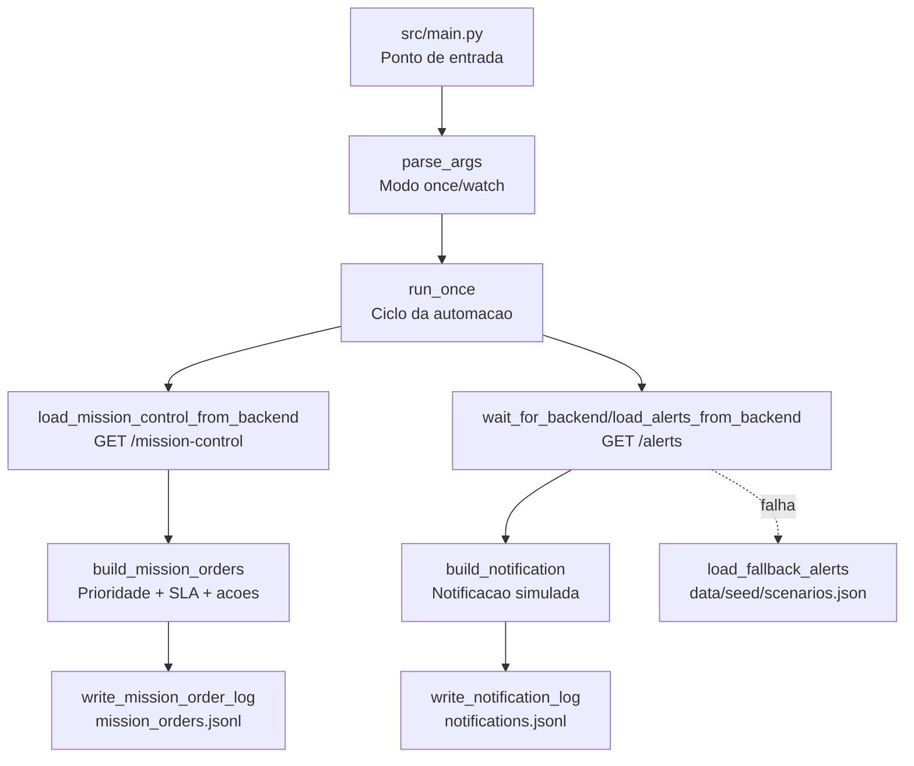
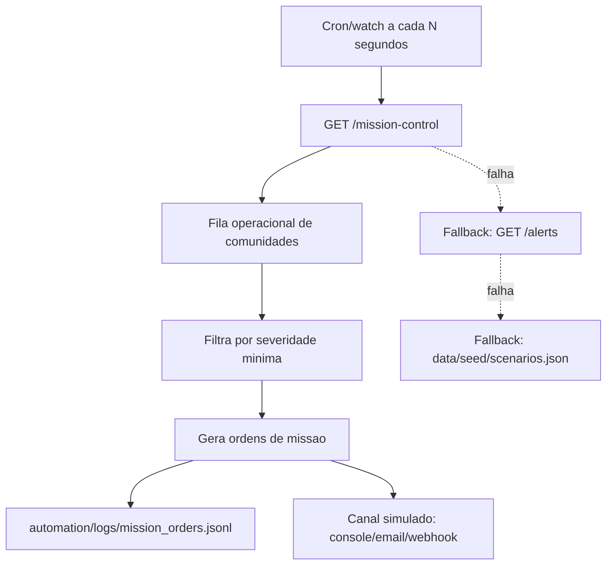

# automation

Rotinas de automacao e Mission Control do AstroWater AI.

## Visao para avaliacao

Este modulo simula uma rotina operacional recorrente, no estilo de um centro de controle de missao. Em vez de apenas exibir dados no dashboard, ele consulta o backend periodicamente, transforma telemetria em uma fila de acoes e registra ordens de missao com prioridade, SLA, evidencias e proximo passo.

Na narrativa da GS, isso mostra que a POC nao para em coleta de dados: ela automatiza uma decisao de triagem, como sistemas espaciais que transformam telemetria em procedimento operacional.

Responsabilidades:

- Consultar o plano operacional em `GET /mission-control`.
- Ordenar comunidades por prioridade de triagem.
- Gerar uma fila de acoes com evidencias, SLA e modulo responsavel.
- Registrar ordens de missao e notificacoes simuladas.
- Manter fallback por alertas quando o backend estiver indisponivel.

## Estrutura da pasta

```text
automation/
├── Dockerfile
├── README.md
├── requirements.txt
└── src/
    ├── __init__.py
    └── main.py
```

### Arquivos da raiz

| Arquivo | Resumo |
| --- | --- |
| `Dockerfile` | Define a imagem Docker da automacao. Instala dependencias, copia o codigo e executa o modo recorrente usado pelo Compose. |
| `README.md` | Documentacao do modulo de automacao, explicando Mission Control, variaveis, execucao e logs. |
| `requirements.txt` | Dependencias Python usadas pela automacao, principalmente `httpx` para chamadas HTTP e `python-dotenv` para carregar variaveis locais. |

### Pasta `src`

| Arquivo | Resumo |
| --- | --- |
| `__init__.py` | Marca `src` como pacote Python. |
| `main.py` | Arquivo principal da automacao. Consulta o backend, gera ordens de missao, registra logs, aplica fallback e controla os modos `once` e `watch`. |

### Classes e estruturas principais

| Classe/estrutura | Arquivo | O que representa |
| --- | --- | --- |
| `Notification` | `src/main.py` | Notificacao simulada criada a partir de um alerta. Guarda id do alerta, severidade, mensagem, horario, canal e status. |
| `MissionOrder` | `src/main.py` | Ordem operacional de Mission Control. Guarda comunidade, prioridade, motivo, proximas acoes, modulo responsavel, SLA e status. |

### Funcoes principais

| Funcao | Resumo |
| --- | --- |
| `load_alerts_from_backend` | Busca alertas reais no endpoint `/alerts` do backend. |
| `load_mission_control_from_backend` | Busca a fila operacional no endpoint `/mission-control`. |
| `wait_for_backend` | Tenta conectar ao backend algumas vezes antes de acionar fallback. |
| `load_fallback_alerts` | Carrega cenarios locais quando backend ou Mission Control nao estao disponiveis. |
| `should_notify` | Verifica se um alerta atingiu a severidade minima configurada. |
| `build_notification` | Converte um alerta em notificacao simulada. |
| `write_notification_log` | Grava notificacoes no arquivo `automation/logs/notifications.jsonl`. |
| `build_mission_orders` | Converte a fila do Mission Control em ordens de missao filtradas por severidade. |
| `write_mission_order_log` | Grava ordens no arquivo `automation/logs/mission_orders.jsonl`. |
| `run_once` | Executa um ciclo completo da automacao: Mission Control, alertas, fallback e logs. |
| `parse_args` | Le argumentos de linha de comando, como modo, intervalo, backend e severidade. |
| `main` | Ponto de entrada. Executa uma vez no modo `once` ou roda continuamente no modo `watch`. |

### Como os arquivos se conectam



## Diagrama do ciclo de automacao



## O que o professor deve observar

- A automacao roda de tempos em tempos, como um cron job da POC.
- O modulo usa dados reais do backend quando disponiveis.
- Cada ordem possui prioridade, evidencias e SLA, facilitando entendimento visual.
- O fallback permite demonstrar o modulo mesmo se o backend estiver offline.

## Uso

Rodar uma checagem unica:

```bash
python src/main.py --mode once --backend-url http://localhost:8000
```

Exemplo de saida esperada:

```text
Mission Control ASTRO-MISSION-20260602143000 gerou 2 ordem(ns).
[MISSION] Comunidade Aurora | Critica | SLA 15 min | motivo: Sedimentos visiveis elevam a triagem para estado critico.
```

Rodar monitoramento continuo:

```bash
python src/main.py --mode watch --interval 60
```

No Docker Compose, o servico `automation` ja sobe em modo continuo:

```bash
docker compose up -d automation
```

Por padrao ele executa um ciclo a cada 60 segundos. Para mudar o intervalo, defina no `.env`:

```env
AUTOMATION_INTERVAL_SECONDS=30
```

Isso funciona como um cron job da POC: a cada ciclo, o modulo consulta o Mission Control, gera ordens de missao para prioridades acima do limite configurado e registra os logs.

## Variaveis

- `BACKEND_URL`: URL do backend. Padrao: `http://localhost:8000`.
- `ALERT_MIN_SEVERITY`: `laranja` ou `vermelho`.
- `ALERT_CHANNEL`: canal simulado, por exemplo `console`, `email` ou `webhook`.
- `AUTOMATION_INTERVAL_SECONDS`: intervalo do modo `watch`.

## Saida

As ordens de missao sao registradas em:

```text
automation/logs/mission_orders.jsonl
```

As notificacoes simuladas de compatibilidade sao registradas em:

```text
automation/logs/notifications.jsonl
```

Se o endpoint de Mission Control estiver indisponivel, o modulo usa os alertas do backend. Se o backend estiver offline, usa os cenarios de `data/seed/scenarios.json` como fallback para demonstracao.

## Por que isso se conecta ao tema espacial

Em missoes espaciais, dados de sensores nao viram apenas graficos: eles viram fila de decisao operacional. O modulo simula esse comportamento para a Terra, transformando telemetria do ESP32, visao computacional do Raspberry Pi e perfil quimico ML em uma ordem clara de triagem para cada comunidade.
