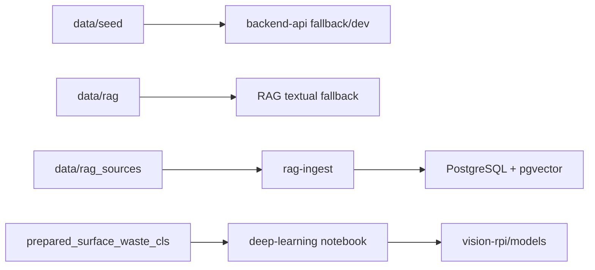

# data

Dados usados pela POC.

## Visao para avaliacao

Esta pasta guarda os dados usados para demonstracao, testes, fallback e RAG. Ela permite que a POC funcione mesmo quando algum servico externo esta indisponivel, o que e importante para apresentacao em sala.

## Estrutura

- `seed`: comunidades, leituras, cenarios e analises visuais iniciais.
- `rag`: documentos internos resumidos para fallback textual do RAG.
- `rag_sources`: fontes ouro e textos processados para embeddings e pgvector.
- `samples`: espaco para amostras e imagens de exemplo.
- `prepared_surface_waste_cls`: dataset preparado para classificacao visual.

## Diagrama de uso dos dados

## Fontes RAG

`data/rag_sources` contem manifesto, fontes brutas e textos processados. As fontes ouro iniciais incluem WHO, CDC, EPA e NASA, alem de documentos internos do projeto. O objetivo e evitar respostas generativas sem origem clara.

## Quando esta pasta e usada

- O backend carrega `seed` quando nao ha PostgreSQL local.
- O `rag-ingest` converte `rag_sources` em chunks vetoriais.
- O AI/RAG Service usa `rag` como fallback textual.
- Os notebooks e scripts podem usar datasets preparados para experimentos.
