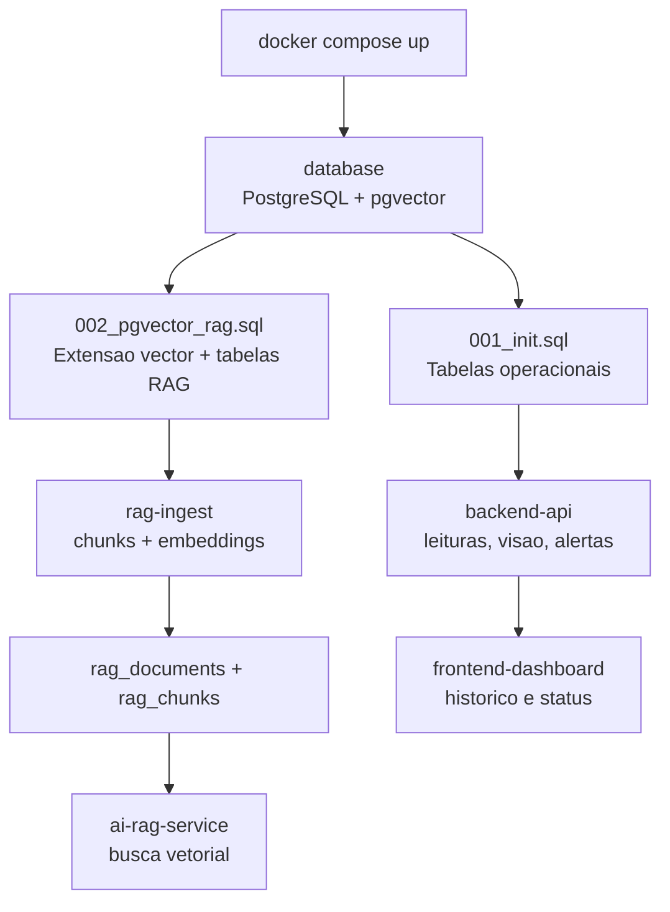
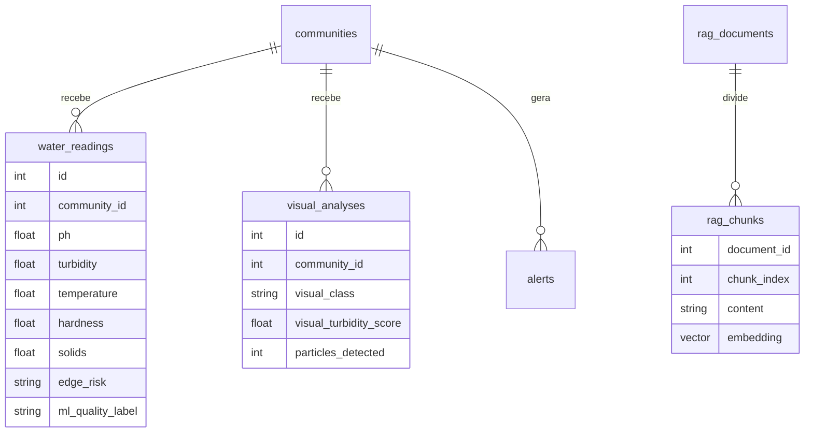

# database

Scripts de inicializacao do banco de dados.

## Visao para avaliacao

Este modulo prepara a camada de persistencia do AstroWater AI. O banco guarda comunidades, leituras de sensores, analises visuais, alertas e a base vetorial usada pelo RAG. No Docker Compose, ele sobe com PostgreSQL + pgvector.

## Estrutura da pasta

```text
database/
├── README.md
└── init/
    ├── 001_init.sql
    └── 002_pgvector_rag.sql
```

### Arquivos da raiz

| Arquivo | Resumo |
| --- | --- |
| `README.md` | Documentacao da camada de banco, explicando tabelas, scripts de inicializacao, pgvector e cuidados com volumes. |

### Pasta `init`

| Arquivo | Resumo |
| --- | --- |
| `001_init.sql` | Cria as tabelas operacionais da POC: comunidades, leituras de sensores, analises visuais e alertas. Tambem insere as comunidades padrao. |
| `002_pgvector_rag.sql` | Ativa a extensao `vector` e cria as tabelas vetoriais do RAG: documentos, chunks, metadados e indice de similaridade. |

### Tabelas operacionais

| Tabela | Criada em | Resumo |
| --- | --- | --- |
| `communities` | `001_init.sql` | Guarda as comunidades monitoradas, com nome, local, cenario e risco esperado para a POC. |
| `water_readings` | `001_init.sql` | Guarda leituras enviadas pelo ESP32/Wokwi via Node-RED, incluindo pH, turbidez, temperatura, parametros de ML, `edge_risk` e origem. |
| `visual_analyses` | `001_init.sql` | Guarda analises visuais enviadas pelo Raspberry Pi, incluindo classe visual, score, particulas, modelo, confianca e origem. |
| `alerts` | `001_init.sql` | Guarda alertas gerados pelo backend quando a prioridade consolidada exige atencao operacional. |

### Tabelas do RAG

| Tabela | Criada em | Resumo |
| --- | --- | --- |
| `rag_documents` | `002_pgvector_rag.sql` | Guarda cada fonte de conhecimento usada pelo RAG, com titulo, tipo, URL, caminho local, nivel de confianca e metadados. |
| `rag_chunks` | `002_pgvector_rag.sql` | Guarda os trechos dos documentos e seus embeddings `vector(768)`, usados para busca semantica com `pgvector`. |

### Indices e extensoes

| Item | Resumo |
| --- | --- |
| `CREATE EXTENSION vector` | Habilita o `pgvector`, necessario para armazenar e comparar embeddings. |
| `rag_documents_source_type_idx` | Facilita consultas por tipo de fonte, como `gold` ou `project`. |
| `rag_documents_trusted_level_idx` | Facilita consultas por nivel de confianca da fonte. |
| `rag_chunks_document_id_idx` | Facilita localizar chunks de um documento especifico. |
| `rag_chunks_embedding_idx` | Indice `ivfflat` com `vector_cosine_ops`, usado para busca vetorial por similaridade. |

### Como os scripts se conectam



## Diagrama de persistencia



## Arquivos principais

- `init/001_init.sql`: cria tabelas principais da POC.
- `init/002_pgvector_rag.sql`: cria extensao `vector`, tabelas do RAG e indice vetorial.

## pgvector

O RAG vetorial usa PostgreSQL com a extensao `pgvector`.

O `docker-compose.yml` usa a imagem:

```text
pgvector/pgvector:pg16
```

O script `init/002_pgvector_rag.sql` cria:

- extensao `vector`;
- tabela `rag_documents`;
- tabela `rag_chunks`;
- indice vetorial `ivfflat` com `vector_cosine_ops`.

## Atencao sobre volumes existentes

Os arquivos em `database/init` rodam automaticamente apenas na primeira inicializacao do volume do PostgreSQL.

Se o volume `astrowater-db` ja existia antes da criacao do script `002_pgvector_rag.sql`, existem duas opcoes:

1. recriar o volume em ambiente de desenvolvimento;
2. executar o SQL manualmente no banco existente.

No fluxo atual do `docker-compose.yml`, a base vetorial do RAG tambem e carregada automaticamente pelo servico one-shot `rag-ingest`. Ele espera o banco ficar saudavel, executa `ai-rag-service/scripts/ingest_knowledge_base.py --rebuild` e finaliza. O servico `ai-rag-service` so inicia depois que esse job termina com sucesso.

Para validar a extensao:

```powershell
docker compose exec database psql -U astrowater -d astrowater -c "SELECT extname FROM pg_extension WHERE extname = 'vector';"
```
