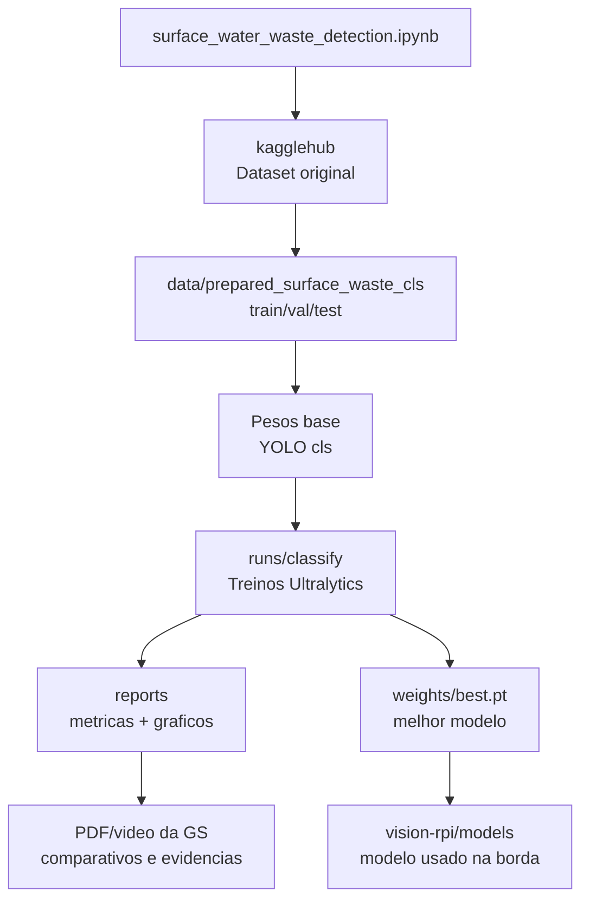
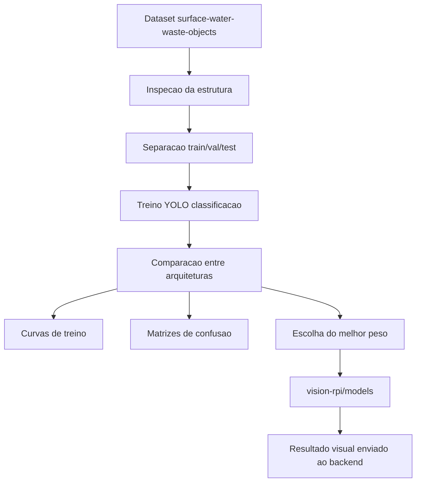

# Deep Learning - AstroWater AI

Este modulo treina e compara modelos de classificacao de imagem para identificar residuos e sinais visuais de poluicao em aguas superficiais.

## Visao para avaliacao

Este modulo demonstra a parte de Deep Learning aplicada a visao computacional. A ideia e sair de uma classificacao simples por cor e treinar modelos capazes de reconhecer sinais visuais de poluicao, residuos e materiais flutuantes em agua superficial.

O notebook tambem registra uma decisao importante de arquitetura: o dataset usado e de classificacao por imagem, nao de deteccao com bounding boxes. Por isso, a narrativa correta e "classificacao visual de residuos", nao "deteccao de objetos com caixas".

Dataset usado:

```python
import kagglehub

path = kagglehub.dataset_download("orvillethomas/dataset-for-surface-water-waste-objects")
print("Path to dataset files:", path)
```

## Estrutura da pasta

```text
deep-learning/
├── README.md
├── requirements.txt
├── surface_water_waste_detection.ipynb
├── yolo11n-cls.pt
├── yolo26n.pt
├── yolov8n-cls.pt
├── yolov8s-cls.pt
├── scripts/
│   └── rebuild_classification_notebook.py
├── data/
│   └── prepared_surface_waste_cls/
│       ├── train/
│       ├── val/
│       └── test/
├── reports/
│   ├── classification_model_comparison.csv
│   ├── classification_model_comparison.png
│   ├── classification_confusion_matrices.png
│   ├── classification_training_curves.csv
│   ├── classification_training_curves.png
│   ├── classification_splits.csv
│   ├── class_name_map.json
│   └── ...
└── runs/
    └── classify/
        ├── astrowater_yolo11n-cls/
        ├── astrowater_yolov8n-cls/
        └── astrowater_yolov8s-cls/
```

### Arquivos da raiz

| Arquivo | Resumo |
| --- | --- |
| `README.md` | Documentacao do modulo de Deep Learning, explicando objetivo, dataset, execucao, artefatos e integracao com a POC. |
| `requirements.txt` | Dependencias do notebook, como `ultralytics`, `torch`, `opencv-python`, `pandas`, `matplotlib`, `seaborn`, `scikit-learn` e `kagglehub`. |
| `surface_water_waste_detection.ipynb` | Notebook principal. Baixa o dataset, analisa imagens, prepara splits, treina modelos YOLO de classificacao, compara resultados e gera graficos. |
| `yolo11n-cls.pt` | Peso base YOLO 11 nano para classificacao, usado como ponto de partida de treino/comparacao. |
| `yolov8n-cls.pt` | Peso base YOLOv8 nano para classificacao. |
| `yolov8s-cls.pt` | Peso base YOLOv8 small para classificacao. |
| `yolo26n.pt` | Peso YOLO adicional mantido como artefato/experimento local; nao e o principal da narrativa final. |

### Pasta `scripts`

| Arquivo | Resumo |
| --- | --- |
| `rebuild_classification_notebook.py` | Script utilitario para reconstruir/atualizar o notebook de classificacao. Ajuda a manter o notebook reproduzivel quando as celulas precisam ser regeneradas. |

### Pasta `data`

| Pasta/arquivo | Resumo |
| --- | --- |
| `data/prepared_surface_waste_cls/` | Dataset preparado no formato esperado pelo YOLO classificacao. |
| `data/prepared_surface_waste_cls/train/` | Imagens usadas para treinamento, separadas por classe. |
| `data/prepared_surface_waste_cls/val/` | Imagens usadas para validacao durante o treinamento. |
| `data/prepared_surface_waste_cls/test/` | Imagens reservadas para avaliacao final. |
| `*.cache` | Arquivos de cache gerados pelo Ultralytics para acelerar leitura das imagens. |

Classes principais presentes no dataset preparado:

| Classe | Significado na POC |
| --- | --- |
| `Plastic_Water_Bottles` | Garrafas plasticas visiveis na superficie da agua. |
| `Plastic_Bags` | Sacolas plasticas ou residuos similares. |
| `Plastic_Straws` | Canudos ou residuos plasticos estreitos. |
| `Leaves` | Folhas e materia organica flutuante. |
| `Birds` / `Bird_Feathers` | Elementos naturais que podem aparecer na superficie, mas nao representam necessariamente lixo industrial. |
| `Combined` | Imagens com mistura de classes ou residuos diferentes. |

### Pasta `reports`

| Arquivo | Resumo |
| --- | --- |
| `classification_model_comparison.csv` | Tabela comparando metricas dos modelos treinados. |
| `classification_model_comparison.png` | Grafico visual da comparacao entre arquiteturas. |
| `classification_confusion_matrices.png` | Matrizes de confusao dos modelos, usadas para analisar erros por classe. |
| `classification_training_curves.csv` | Dados das curvas de treinamento por epoca. |
| `classification_training_curves.png` | Grafico das curvas de treino/validacao. |
| `classification_splits.csv` | Registro de quais imagens foram para treino, validacao e teste. |
| `classification_training_runs.csv` | Resumo das execucoes de treinamento realizadas. |
| `class_name_map.json` | Mapeia nomes seguros de pasta para os nomes originais das classes. |
| `dataset_classification_overview.png` | Grafico de visao geral da distribuicao do dataset. |
| `image_metadata.csv` | Metadados coletados das imagens para analise exploratoria. |
| `sample_images_by_class.png` | Grade com exemplos de imagens por classe. |
| `sample_predictions_grid.png` | Grade com predicoes de exemplo do modelo. |
| `sample_visual_pollution_scores.csv` | Pontuacoes visuais auxiliares usadas na analise do notebook. |
| `*_test_predictions.csv` | Predicoes por modelo no conjunto de teste. |

### Pasta `runs`

| Pasta/arquivo | Resumo |
| --- | --- |
| `runs/classify/astrowater_yolo11n-cls/` | Resultado de treino do YOLO 11 nano classificacao. |
| `runs/classify/astrowater_yolov8n-cls/` | Resultado de treino do YOLOv8 nano classificacao. |
| `runs/classify/astrowater_yolov8s-cls/` | Resultado de treino do YOLOv8 small classificacao. |
| `args.yaml` | Parametros usados na execucao de treino. |
| `results.csv` | Historico de metricas por epoca gerado pelo Ultralytics. |
| `confusion_matrix.png` | Matriz de confusao do treino/validacao. |
| `train_batch*.jpg` | Amostras de batches usados durante o treinamento. |
| `val_batch*_labels.jpg` | Exemplos de imagens de validacao com labels reais. |
| `val_batch*_pred.jpg` | Exemplos de imagens de validacao com predicoes do modelo. |
| `weights/best.pt` | Melhor peso do treinamento, candidato para copiar ao `vision-rpi/models`. |
| `weights/last.pt` | Ultimo peso salvo no treinamento. |

### Como os arquivos se conectam



## Objetivo

Substituir a narrativa de "classificacao pela cor da agua" por uma abordagem mais forte: classificacao visual de residuos, sujeira e materiais flutuantes na superficie da agua usando deep learning.

Observacao importante: este dataset esta organizado por pastas de classe e nao possui bounding boxes. Portanto, ele e adequado para classificacao de imagem. Para deteccao de objetos com caixas delimitadoras, seria necessario usar outro dataset anotado ou criar anotacoes manualmente.

## Diagrama do experimento



## Como isso entra na POC

- O notebook treina e compara os modelos.
- Os melhores pesos ficam disponiveis em `vision-rpi/models`.
- O Raspberry Pi tenta usar o modelo quando o ambiente suporta PyTorch/Ultralytics.
- Se o hardware ficar pesado, o script usa OpenCV como fallback de borda.
- O backend recebe a classe visual e combina com sensores e ML tabular.

## Como executar

```powershell
cd deep-learning
python -m venv .venv
.venv\Scripts\Activate.ps1
pip install -r requirements.txt
jupyter notebook
```

Para usar GPU NVIDIA no Windows, instale o PyTorch com CUDA dentro do mesmo ambiente virtual usado pelo Jupyter:

```powershell
.\.venv\Scripts\python.exe -m pip install --upgrade --force-reinstall torch torchvision torchaudio --index-url https://download.pytorch.org/whl/cu130
```

Depois reinicie o kernel do notebook e valide se ele mostra `CUDA disponivel: True` na etapa de treinamento. Se continuar aparecendo CPU, selecione o kernel da `.venv` no Jupyter.

Abra o notebook:

```text
surface_water_waste_detection.ipynb
```

## Artefatos gerados

- `data/raw`: dataset baixado pelo KaggleHub.
- `runs`: treinamentos de classificacao gerados pelo Ultralytics/YOLO.
- `reports`: graficos, tabelas comparativas, matrizes de confusao, curvas de treino e predicoes de exemplo.
- `models`: pesos exportados ou copiados para integracao futura.

## Como explicar na GS

O Raspberry Pi com camera captura uma imagem da agua superficial. O modelo de deep learning identifica residuos visuais e gera um indice de poluicao visual. O backend combina esse indice com sensores simulados do ESP32 e com o modelo tabular de potabilidade.
