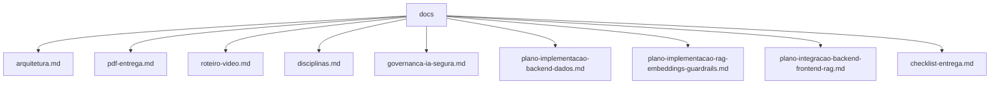

# docs

Documentacao de apoio para a entrega da Global Solution 2026.1.

## Visao para avaliacao

Esta pasta organiza os documentos que explicam a arquitetura, o escopo, a relacao com disciplinas, o roteiro do video e o material base para o PDF. O objetivo e permitir que o avaliador entenda rapidamente o que foi construido, por que foi construido e como cada tecnologia aparece na POC.

## Mapa da documentacao

## Arquivos principais

| Arquivo | Para que serve |
| --- | --- |
| `arquitetura.md` | Explica o fluxo entre Wokwi, Node-RED, backend, PostgreSQL, Raspberry Pi, frontend e RAG. |
| `pdf-entrega.md` | Documento-base para montar o PDF final da entrega. |
| `roteiro-video.md` | Roteiro de ate 5 minutos para demonstracao. |
| `disciplinas.md` | Mapeia a solucao com conteudos das Fases 3 e 4. |
| `governanca-ia-segura.md` | Explica validacao, guardrails, limites eticos e prompt injection. |
| `checklist-entrega.md` | Lista final de conferencia antes de enviar. |
| `AstroWater_AI_documento_entrega.docx` | Documento Word gerado como base editavel para o PDF final. |

## Ordem recomendada de leitura

1. Leia `arquitetura.md` para entender o sistema.
2. Leia `disciplinas.md` para ver a relacao com a FIAP.
3. Use `pdf-entrega.md` ou `AstroWater_AI_documento_entrega.docx` como base do PDF.
4. Use `roteiro-video.md` para gravar a demonstracao.
5. Feche com `checklist-entrega.md`.

## Pontos que precisam ser preenchidos antes da entrega

- Nome completo e RM dos integrantes.
- Link do repositorio.
- Link do video no YouTube como nao listado.
- Prints reais do dashboard, Wokwi, Node-RED, Raspberry Pi, RAG e Mission Control.
- Trechos de codigo em texto, nunca em print.
