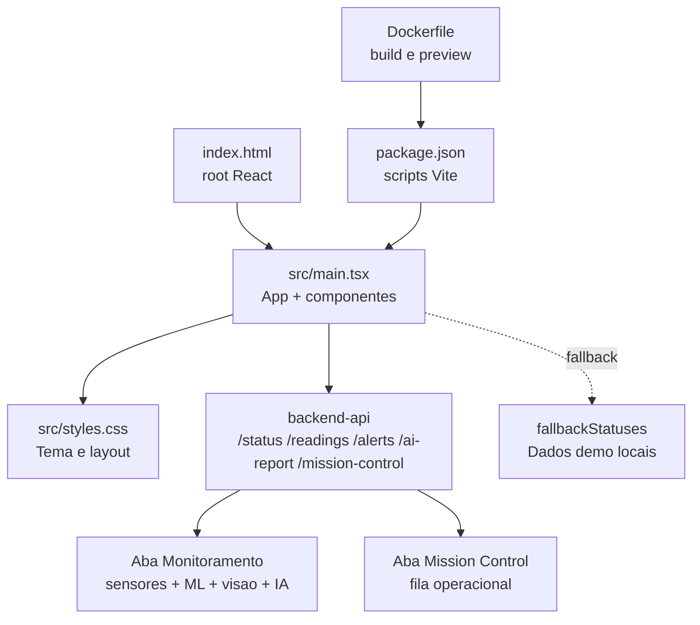
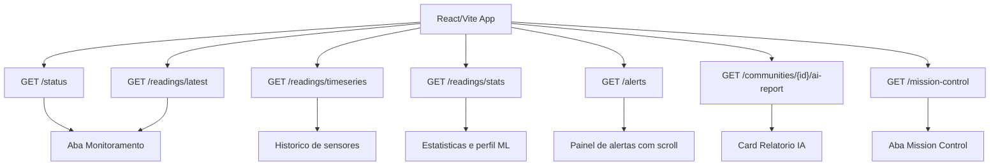

# frontend-dashboard

Dashboard React/Vite do AstroWater AI.

## Visao para avaliacao

Este modulo e a interface principal da POC. Ele foi desenhado com tema visual de exploracao espacial para reforcar a conexao com a economia espacial, mas mantendo foco operacional: comunidades, prioridade de triagem, historico, perfil quimico, visao computacional, relatorio IA e Mission Control.

O frontend consome apenas o `backend-api`. Isso deixa a arquitetura mais segura, porque a chave do Gemini e a logica RAG nao ficam expostas no navegador.

Responsabilidades:

- Exibir comunidades monitoradas.
- Mostrar pH, turbidez, temperatura e risco.
- Apresentar resultados de visao computacional.
- Mostrar historico, estatisticas, parametros de Machine Learning, classificacao de potabilidade, alertas e relatorios gerados por IA.

## Estrutura da pasta

```text
frontend-dashboard/
├── Dockerfile
├── README.md
├── index.html
├── package.json
├── package-lock.json
├── tsconfig.json
├── vite-env.d.ts
└── src/
    ├── main.tsx
    └── styles.css
```

### Arquivos da raiz

| Arquivo | Resumo |
| --- | --- |
| `Dockerfile` | Define a imagem Docker do dashboard. Instala dependencias, executa build Vite e serve a aplicacao na porta `3000`. |
| `README.md` | Documentacao do modulo frontend, explicando tela, endpoints, fallback, validacao e integracao com backend. |
| `index.html` | HTML base usado pelo Vite. Contem o elemento `root` onde o React renderiza a aplicacao. |
| `package.json` | Scripts e dependencias do frontend, incluindo React, Vite e TypeScript. |
| `package-lock.json` | Trava as versoes das dependencias instaladas para reproducibilidade. |
| `tsconfig.json` | Configuracao TypeScript usada pelo Vite/React. |
| `vite-env.d.ts` | Tipagens auxiliares do Vite, incluindo suporte a `import.meta.env`. |

### Pasta `src`

| Arquivo | Resumo |
| --- | --- |
| `main.tsx` | Arquivo principal do dashboard. Define tipos, dados fallback, chamadas ao backend, helpers de formatacao, componentes React e renderizacao da aplicacao. |
| `styles.css` | Estilos visuais do dashboard, incluindo tema espacial, layout responsivo, cards, graficos, alertas, Mission Control e estados de prioridade. |

### Tipos principais em `main.tsx`

| Tipo | O que representa |
| --- | --- |
| `Risk` | Prioridades aceitas no dashboard: `verde`, `amarelo`, `laranja` e `vermelho`. |
| `Community` | Comunidade monitorada, com nome, local, cenario e risco esperado. |
| `WaterReading` | Leitura de sensores recebida do backend, incluindo pH, turbidez, temperatura, parametros de ML e `edgeRisk`. |
| `VisualAnalysis` | Analise visual enviada pelo Raspberry Pi, com classe visual, score, particulas, modelo e confianca. |
| `CommunityStatus` | Status consolidado de uma comunidade, unindo comunidade, ultima leitura, ultima analise visual, risco final, motivos e recomendacao. |
| `Alert` | Alerta gerado pelo backend para uma comunidade. |
| `MetricSummary` | Resumo estatistico com minimo, media e maximo. |
| `ReadingStats` | Estatisticas agregadas das leituras, incluindo distribuicao de riscos. |
| `AiReportSource` | Fonte recuperada pelo RAG, com titulo, score, metodo e nivel de confianca. |
| `AiReport` | Relatorio gerado pelo AI/RAG Service e entregue pelo backend ao frontend. |
| `MissionOrder` | Ordem operacional da aba Mission Control, com prioridade, evidencias, SLA e proximas acoes. |
| `MissionControlPlan` | Plano completo de Mission Control, incluindo resumo e fila de ordens. |

### Funcoes e componentes principais

| Nome | Tipo | Resumo |
| --- | --- | --- |
| `fetchJson` | Helper | Faz chamadas HTTP ao backend usando `VITE_API_BASE_URL` ou `http://localhost:8000`. |
| `buildFallbackStats` | Helper | Monta estatisticas locais quando a API nao esta disponivel. |
| `summarize` | Helper | Calcula minimo, media e maximo de uma lista numerica. |
| `formatNumber`, `formatDate`, `formatTime`, `formatScore` | Helpers | Formatam valores numericos, datas, horarios e scores para exibicao. |
| `riskLabel` e `riskShortLabel` | Helpers | Convertem o codigo interno de risco em textos exibidos nos cards. |
| `qualityLabel`, `chemicalProfileLabel`, `chemicalProfileHelper` | Helpers | Traduzem o resultado do ML tabular e explicam quando ele e evidencia auxiliar. |
| `visualMetricLabel` | Helper | Traduz classes visuais do Raspberry Pi para labels curtos no dashboard. |
| `primaryReason` | Helper | Seleciona a principal justificativa da prioridade atual. |
| `buildFallbackMissionPlan` | Helper | Cria uma fila Mission Control local usando dados demo. |
| `missionActionsForRisk` e `missionSla` | Helpers | Definem acoes e SLA de acordo com a prioridade. |
| `cleanAiText` | Helper | Remove marcacoes simples de Markdown do texto gerado pela IA. |
| `App` | Componente | Componente principal. Controla estado, carrega API, alterna abas e renderiza o dashboard. |
| `MissionControlView` | Componente | Renderiza a aba de automacao com fila operacional, SLA e proximas acoes. |
| `SensorChart` | Componente | Renderiza grafico SVG de pH, turbidez e temperatura. |
| `MetricMini` | Componente | Renderiza cards pequenos de parametros do modelo de ML. |
| `StatsRow` | Componente | Renderiza linhas de estatisticas `min/media/max`. |
| `RiskBar` | Componente | Renderiza barras de distribuicao por risco. |
| `Summary` | Componente | Renderiza cards de resumo do topo e da aba Mission Control. |
| `Metric` | Componente | Renderiza cards principais de pH, turbidez, temperatura, rede, visual e perfil ML. |

### Como os arquivos se conectam



## Diagrama de telas e dados



## Qualidade por Machine Learning

O ESP32 publica somente via MQTT. O Node-RED recebe a mensagem e encaminha para o backend, que executa o modelo treinado de potabilidade antes de salvar no banco.

Campos exibidos no dashboard:

- `mlQualityLabel`: classificacao auxiliar do modelo (`potavel`, `nao_potavel`, `baixa_confianca`, `dados_insuficientes`, `modelo_indisponivel` ou `erro_inferencia`).
- `mlPotabilityProbability`: probabilidade/confiança retornada pelo modelo quando disponivel.
- `mlModelName`: nome do modelo aplicado no backend.

Correspondencia visual:

| `mlQualityLabel` | Nome exibido no dashboard |
| --- | --- |
| `potavel` | Sem alerta ML |
| `nao_potavel` | Alerta ML |
| `baixa_confianca` | Inconclusivo |
| `dados_insuficientes` | Dados insuf. |
| `modelo_indisponivel` | Modelo off |
| `erro_inferencia` | Erro ML |

Quando `mlPotabilityProbability` fica abaixo de `0.65`, o backend marca `baixa_confianca` e o dashboard exibe `Inconclusivo`. Esse resultado nao reduz a prioridade final de triagem; ele apenas informa que o modelo tabular nao teve confianca suficiente para uma conclusao forte.

## Endpoints consumidos

- `GET /status`
- `GET /readings/latest?communityId=1`
- `GET /readings/timeseries?communityId=1&limit=50`
- `GET /readings/stats?communityId=1`
- `GET /alerts?communityId=1`

## Variaveis

- `VITE_API_BASE_URL`: URL do backend. Padrao local: `http://localhost:8000`.

## Comportamento offline

Se a API nao estiver disponivel, o dashboard usa dados demonstrativos coerentes com `data/seed`, permitindo apresentar a interface mesmo antes de subir toda a stack.

Com a API online, a comunidade selecionada e atualizada automaticamente a cada 5 segundos para refletir novas medicoes recebidas via MQTT/Node-RED.

## Validacao

```bash
npm run build
npm run preview -- --host 127.0.0.1 --port 5173
```
