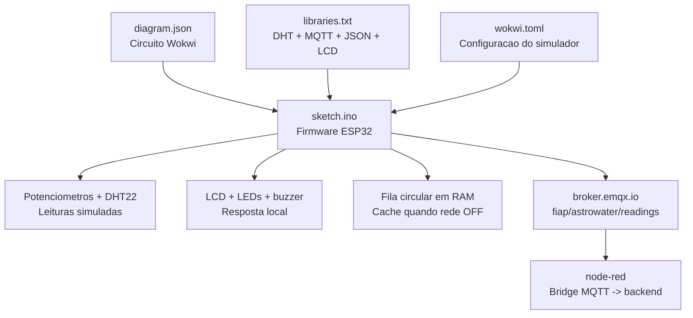
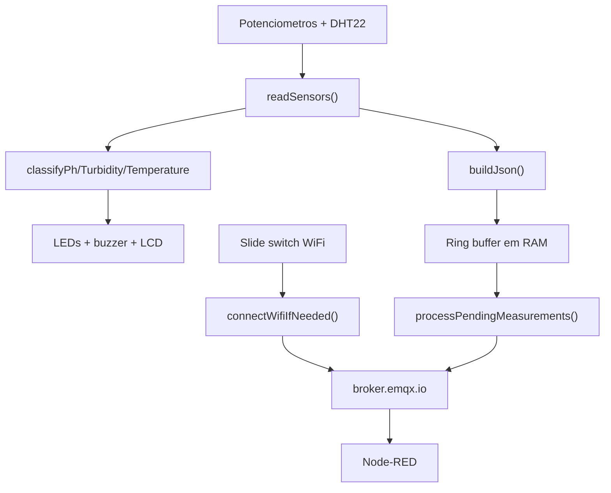

# iot-wokwi

Projeto Wokwi do no ESP32 simulado do AstroWater AI.

## Visao para avaliacao

Este modulo representa a camada embarcada/IoT da POC. Ele simula um ESP32 em campo coletando sinais de agua, tomando uma decisao local de triagem e publicando telemetria via MQTT. A escolha por MQTT, fila local e decisao na borda reforca conceitos de Edge Computing e IoT eficiente.

O professor deve observar que o ESP32 nao e apenas decorativo: ele calcula `edgeRisk`, aciona LED/LCD/buzzer localmente, armazena medicoes em fila quando a rede cai e sincroniza depois.

## Estrutura da pasta

```text
iot-wokwi/
├── README.md
├── diagram.json
├── libraries.txt
├── sketch.ino
└── wokwi.toml
```

### Arquivos da raiz

| Arquivo | Resumo |
| --- | --- |
| `README.md` | Documentacao do modulo IoT/Wokwi, com componentes, pinos, regras de risco, MQTT, fila circular e diagnostico. |
| `sketch.ino` | Firmware do ESP32. Le sensores simulados, calcula `edgeRisk`, atualiza LCD/LED/buzzer, gerencia fila local e publica MQTT. |
| `diagram.json` | Circuito Wokwi com ESP32, potenciometros, DHT22, LCD, LEDs, buzzer e slide switch de rede. |
| `libraries.txt` | Lista de bibliotecas usadas no simulador Wokwi. |
| `wokwi.toml` | Configuracao do projeto Wokwi, apontando sketch, diagrama e parametros do simulador. |

### Estruturas principais no `sketch.ino`

| Estrutura | O que representa |
| --- | --- |
| `RiskLevel` | Enum interno com os niveis `RISK_GREEN`, `RISK_YELLOW`, `RISK_ORANGE` e `RISK_RED`. |
| `SensorReading` | Estrutura com todos os valores lidos ou simulados: pH, turbidez, temperatura, parametros do ML, leituras brutas e risco calculado. |
| `CachedPayload` | Item armazenado na fila circular quando a rede esta desligada ou o MQTT falha. |

### Funcoes principais no `sketch.ino`

| Funcao | Resumo |
| --- | --- |
| `mapFloat` | Converte uma leitura analogica bruta para uma faixa fisica simulada. |
| `logLine` | Escreve logs no Serial Monitor de forma centralizada. |
| `writeLed` | Liga/desliga LEDs respeitando a configuracao de polaridade. |
| `isNetworkSwitchOn` | Le o slide switch que simula rede WiFi ligada ou desligada. |
| `readAdc2WithWifiFallback` | Le pinos ADC2 e usa fallback quando o WiFi interfere na leitura. |
| `riskCause` | Retorna a causa principal exibida no LCD/Serial para o risco atual. |
| `readSensors` | Le potenciometros e DHT22, calcula parametros operacionais e campos do dataset de ML. |
| `updateOutputs` | Atualiza LEDs e buzzer conforme o risco local. |
| `buildJson` | Monta o payload JSON enviado ao MQTT e exibido no Serial Monitor. |
| `updateDisplay` | Atualiza o LCD 16x2 com pH, turbidez, risco e causa resumida. |
| `enqueueMeasurement` | Salva uma medicao na fila circular em RAM. |
| `peekOldestPayload` | Consulta a medicao mais antiga ainda pendente na fila. |
| `removeOldestPayload` | Remove da fila a medicao que foi enviada com sucesso. |
| `connectWifiIfNeeded` | Conecta ou desconecta WiFi conforme o slide switch. |
| `connectMqttIfNeeded` | Garante conexao MQTT com `broker.emqx.io`. |
| `publishMqtt` | Publica o payload no topico MQTT configurado. |
| `processPendingMeasurements` | Sincroniza medicoes pendentes quando rede/MQTT voltam. |
| `collectMeasurement` | Executa um ciclo completo de leitura, saida local, JSON e cache. |
| `handleNetworkSwitch` | Detecta mudanca do slide switch e registra transicao de rede. |
| `setup` | Inicializa Serial, pinos, DHT22, LCD, WiFi/MQTT e estados iniciais. |
| `loop` | Agenda coleta, rede e sincronizacao sem usar `delay()` bloqueante. |

### Como os arquivos se conectam



## Diagrama do firmware



## Componentes

- ESP32 DevKit C v4 (`board-esp32-devkit-c-v4`).
- Potenciometro 1 para simular o sensor analogico de pH.
- Potenciometro 2 para simular o sensor analogico de turbidez.
- Potenciometros adicionais para simular os parametros do dataset de potabilidade usado no Machine Learning.
- DHT22 para simular temperatura.
- LED verde para risco `verde`.
- LED amarelo para risco `amarelo` ou `laranja`.
- LED vermelho para risco `vermelho`.
- Buzzer para alerta critico.
- LCD 16x2 I2C para leituras locais.
- Slide switch para simular rede WiFi ligada/desligada.

## Pinos

| Componente | Pino ESP32 | Funcao |
| --- | --- | --- |
| Potenciometro pH | GPIO34 | Entrada analogica |
| Potenciometro turbidez/ML Turbidity | GPIO35 | Entrada analogica |
| Potenciometro Hardness | GPIO32 | Entrada analogica |
| Potenciometro Solids | GPIO33 | Entrada analogica |
| Potenciometro Chloramines | GPIO36 | Entrada analogica |
| Potenciometro Sulfate | GPIO39 | Entrada analogica |
| Potenciometro Conductivity | GPIO4 | Entrada analogica |
| Potenciometro Organic_carbon | GPIO13 | Entrada analogica |
| Potenciometro Trihalomethanes | GPIO12 | Entrada analogica |
| DHT22 | GPIO15 | Temperatura |
| Slide switch WiFi | GPIO16 | Simula rede ON/OFF com `INPUT_PULLUP` |
| LED verde | GPIO25 | Status seguro |
| LED amarelo | GPIO26 | Atencao/risco elevado |
| LED vermelho | GPIO27 | Critico |
| Buzzer | GPIO14 | Alerta local |
| LCD SDA | GPIO21 | I2C |
| LCD SCL | GPIO22 | I2C |

## Regras locais

O ESP32 faz uma classificacao inicial na borda:

- pH abaixo de `6.0` ou acima de `9.0`: `vermelho`.
- pH entre `6.0` e `6.5`, ou entre `8.5` e `9.0`: `amarelo`.
- turbidez ate `5 NTU`: `verde`.
- turbidez acima de `5` ate `25 NTU`: `amarelo`.
- turbidez acima de `25` ate `50 NTU`: `laranja`.
- turbidez acima de `50 NTU`: `vermelho`.
- temperatura abaixo de `5C` ou acima de `30C`: `amarelo`.
- temperatura acima de `35C`: `laranja`.

O maior risco entre os sensores vira o `edgeRisk`.

No Wokwi, os sensores analogicos sao representados por potenciometros. Girar o potenciometro do pH altera a escala simulada de `0` a `14`; girar o potenciometro da turbidez altera a escala operacional de `0` a `100 NTU` e tambem gera o campo `Turbidity` na faixa do dataset de ML.

## Como demonstrar os riscos

O circuito inicia em um cenario seguro (`verde`): pH perto de `7`, turbidez baixa e temperatura em `25C`.

| Sensor | Verde | Amarelo | Laranja | Vermelho |
| --- | --- | --- | --- | --- |
| pH | `6.5` a `8.5` | `6.0` a `6.49` ou `8.51` a `9.0` | Nao usado | abaixo de `6.0` ou acima de `9.0` |
| Turbidez operacional | ate `5 NTU` | acima de `5` ate `25 NTU` | acima de `25` ate `50 NTU` | acima de `50 NTU` |
| Temperatura | `5C` a `30C` | abaixo de `5C` ou acima de `30C` | acima de `35C` | Nao usado |

Para mostrar a mudanca no video:

- Comece sem mexer em nada: o LCD deve indicar risco `verde`.
- Aumente o potenciometro de turbidez: passa por `amarelo`, depois `laranja` e depois `vermelho`.
- Mova o pH para muito baixo ou muito alto: o LED vermelho e o buzzer entram quando passa dos limites criticos.
- Altere a temperatura no DHT22 do Wokwi para acima de `35C`: o risco local sobe para `laranja`.

## Diagnostico rapido

Se o LED vermelho ficar aceso direto, olhe primeiro o JSON no Serial Monitor.

- Se `edgeRisk` estiver `vermelho`, algum sensor esta lendo fora da faixa.
- Se `edgeRisk` estiver `verde`, mas o LED vermelho estiver aceso, a fiação do LED esta invertida ou ligada em outro GPIO.
- `rawPh` perto de `2048` deve gerar pH perto de `7.0`.
- `rawTurbidity` perto de `120` deve gerar turbidez perto de `2.9 NTU`.
- `rawPh` ou `rawTurbidity` perto de `4095` costuma indicar potenciometro no maximo, SIG no pino errado ou entrada flutuando.
- `rawPh` ou `rawTurbidity` perto de `0` costuma indicar potenciometro no minimo ou SIG ligado ao GND.

Durante a fase de diagnostico, o LCD chegou a alternar uma tela com valores brutos:

```text
raw pH 2048
raw Tb 120
```

Essa tela foi removida da versao final para deixar a demo mais limpa. Agora o LCD mostra sempre pH, turbidez, risco e causa principal. Se precisar depurar novamente, use o Serial Monitor ou o JSON.

Se o `raw pH` continuar em `4095` mesmo girando o potenciometro, o problema nao e regra de risco: o GPIO34 esta recebendo 3V3 fixo ou o fio de sinal esta no terminal errado. Revise especificamente o potenciometro do pH:

```text
terminal VCC -> 3V3
terminal GND -> GND
terminal SIG -> GPIO34
```

Ligacao esperada do potenciometro no Wokwi:

```text
VCC -> 3V3
GND -> GND
SIG -> GPIO correspondente
```

Se voce ligou os LEDs com anodo no 3V3 e catodo no GPIO, a logica fica invertida. Nesse caso altere no `sketch.ino`:

```cpp
const bool LED_ACTIVE_HIGH = false;
```

## Parametros do Machine Learning

O Serial Monitor tambem imprime todos os campos usados pelo modelo treinado com o dataset `water_potability`:

| Potenciometro | Campo gerado | Faixa simulada | O que representa |
| --- | --- | --- | --- |
| `potPh` | `ph` | 0 a 14 | Acidez/alcalinidade da agua |
| `potTurbidity` | `turbidity` e `Turbidity` | 0 a 100 NTU e 1.45 a 6.74 | Turbidez operacional e turbidez na escala do dataset |
| `potHardness` | `Hardness` | 47 a 323 | Dureza da agua, associada a minerais dissolvidos |
| `potSolids` | `Solids` | 320 a 61227 | Solidos dissolvidos totais simulados |
| `potChloramines` | `Chloramines` | 0.35 a 13.13 | Nivel de cloraminas usado no tratamento da agua |
| `potSulfate` | `Sulfate` | 129 a 481 | Concentracao simulada de sulfato |
| `potConductivity` | `Conductivity` | 181 a 753 | Condutividade eletrica, proxy de ions dissolvidos |
| `potOrganicCarbon` | `Organic_carbon` | 2.2 a 28.3 | Carbono organico total simulado |
| `potTrihalomethanes` | `Trihalomethanes` | 0.74 a 124 | Subprodutos de desinfeccao simulados |

Os campos `ph`, `turbidity` e `temperature` continuam existindo para manter compatibilidade com o backend atual. Os campos com nomes iguais ao dataset (`Hardness`, `Solids`, etc.) podem ser usados pelo modulo de Machine Learning.

O payload tambem envia os valores brutos `rawHardness`, `rawSolids`, `rawChloramines`, `rawSulfate`, `rawConductivity`, `rawOrganicCarbon` e `rawTrihalomethanes`. Esses campos ajudam a auditar se o problema esta no potenciometro, no mapeamento do ESP32 ou no backend.

## Saida JSON

O firmware imprime uma leitura a cada 5 segundos no Serial Monitor:

```json
{
  "deviceId": "ASTRO-ESP32-001",
  "community": "Comunidade Aurora",
  "rawPh": 2048,
  "rawTurbidity": 120,
  "rawHardness": 2048,
  "rawSolids": 2048,
  "rawChloramines": 2048,
  "rawSulfate": 2048,
  "rawConductivity": 1726,
  "rawOrganicCarbon": 1880,
  "rawTrihalomethanes": 2188,
  "ph": 6.99,
  "turbidity": 29.30,
  "temperature": 25.00,
  "Hardness": 195.25,
  "Solids": 21871.44,
  "Chloramines": 7.08,
  "Sulfate": 333.56,
  "Conductivity": 424.12,
  "Organic_carbon": 14.18,
  "Trihalomethanes": 66.37,
  "Turbidity": 3.98,
  "mlTurbidity": 3.98,
  "edgeRisk": "laranja",
  "networkSwitch": "ON",
  "source": "wokwi-esp32"
}
```

## MQTT

O firmware publica o mesmo JSON do Serial Monitor via MQTT usando o broker publico da EMQX:

```cpp
const bool ENABLE_MQTT = true;
const char* MQTT_BROKER = "broker.emqx.io";
const int MQTT_PORT = 1883;
const char* MQTT_TOPIC = "fiap/astrowater/readings";
```

O buffer MQTT foi configurado para `1024` bytes porque o payload completo inclui todos os parametros do modelo de Machine Learning.

Durante depuracao no Wokwi, o projeto pode ficar com:

```cpp
const bool ENABLE_MQTT = false;
const bool ENABLE_SERIAL_JSON = false;
```

Assim o simulador mostra apenas logs compactos no Serial Monitor. Para uma depuracao totalmente offline, altere `ENABLE_MQTT` para `false`.

Para testar fora do Wokwi, assine o topico:

```bash
mosquitto_sub -h broker.emqx.io -p 1883 -t fiap/astrowater/readings
```

Como o broker e publico, o topico deve ser tratado como ambiente de demonstracao. Para evitar colisao com outros grupos, voce pode trocar o topico para algo mais especifico, por exemplo `fiap/astrowater/grupo-felipe/readings`.

O ESP32 nao faz chamada HTTP direta para o backend. Essa decisao reduz consumo de energia, simplifica o firmware embarcado e deixa a arquitetura mais correta para IoT: o dispositivo publica uma mensagem leve no MQTT, e o Node-RED fica responsavel por receber o evento, transformar o payload quando necessario e chamar o backend.

## Arquitetura do firmware

O firmware usa um `loop()` simples com agendamento por `millis()`, no mesmo estilo que costuma funcionar melhor no Serial Monitor do Wokwi:

- A leitura dos sensores roda a cada `5` segundos.
- A rotina de rede roda em intervalos curtos para reconectar WiFi/MQTT e enviar pendencias.
- Nao ha `delay()` bloqueante no fluxo principal; o unico `delay(500)` fica no `setup()` para dar tempo do Serial Monitor abrir no simulador.
- `measurementQueue`: fila circular em RAM com as ultimas medicoes, simulando o buffer que em hardware real poderia ser persistido em cartao SD.

Com isso, o ESP32 continua lendo sensores e atualizando LCD/LED/buzzer mesmo se o MQTT cair ou o WiFi ainda estiver reconectando.

## Fila circular sem cartao SD

Como o Wokwi nao usa cartao SD nesta POC, o firmware guarda as medicoes em uma fila circular em RAM com capacidade para `20` payloads:

```cpp
const uint8_t MEASUREMENT_QUEUE_SIZE = 20;
CachedPayload measurementQueue[MEASUREMENT_QUEUE_SIZE];
```

Fluxo:

- A leitura cria um JSON a cada 5 segundos e chama `enqueueMeasurement`.
- Se WiFi/MQTT estiver fora, a medicao fica armazenada na fila.
- Quando a conexao volta, `processPendingMeasurements()` tenta publicar a medicao mais antiga.
- Se o publish MQTT funcionar, a medicao e removida da fila.
- Se a fila lotar, a medicao mais antiga e descartada para manter as mais recentes, comportamento de ring buffer.

No Serial Monitor aparecem mensagens como:

```text
[CACHE] Medicao salva na RAM (3/20).
[MQTT] Medicao enviada.
[SYNC] Medicao removida da fila. Pendentes: 2
```

Para demonstrar no video, deixe `ENABLE_MQTT = true` e use o slide switch como simulador de queda/retorno de rede:

- Switch em `ON`: o firmware conecta no WiFi/MQTT e envia as medicoes pendentes.
- Switch em `OFF`: o firmware simula queda de rede, desconecta WiFi/MQTT e continua salvando as medicoes no ring buffer em RAM.
- Quando o switch volta para `ON`, a fila e sincronizada com o broker.

No Serial Monitor aparecem mensagens como:

```text
[WIFI] Switch OFF. Rede simulada indisponivel; medicoes ficarao no cache.
[CACHE] Medicao salva na RAM (4/20).
[WIFI] Switch ON. Rede liberada; tentando sincronizar fila.
[MQTT] Medicao enviada.
[SYNC] Medicao removida da fila. Pendentes: 3
```

Observacao: alguns pinos extras usam ADC2. No ESP32 fisico, leituras ADC2 podem conflitar com WiFi ativo, e o GPIO12 tambem exige cuidado por ser pino de bootstrap. Para a demo no Wokwi isso tende a ser aceitavel; em hardware real, prefira usar um multiplexador analogico, um ADC externo ou reduzir os sensores simultaneos em pinos ADC1.

Na simulacao com MQTT ativo, os parametros `Conductivity`, `Organic_carbon` e `Trihalomethanes` ficam em pinos ADC2. Se o Wokwi retornar `0` nesses pinos quando o WiFi estiver conectado, o firmware usa um fallback simulado baseado nos valores iniciais dos potenciometros. No Serial Monitor aparece:

```text
[ADC2] GPIO4 retornou 0 com WiFi ativo. Usando fallback simulado.
```

Isso preserva a demonstracao do fluxo IoT/MQTT/Node-RED sem esconder a limitacao tecnica do ESP32.

Se quiser demonstrar a mudanca desses tres parametros ao vivo, desligue a rede no slide switch, ajuste os potenciometros, deixe as medicoes entrarem na fila e depois ligue a rede novamente para sincronizar via MQTT.

## Arquivos

- `sketch.ino`: firmware do ESP32.
- `diagram.json`: circuito Wokwi.
- `libraries.txt`: bibliotecas usadas na simulacao.
