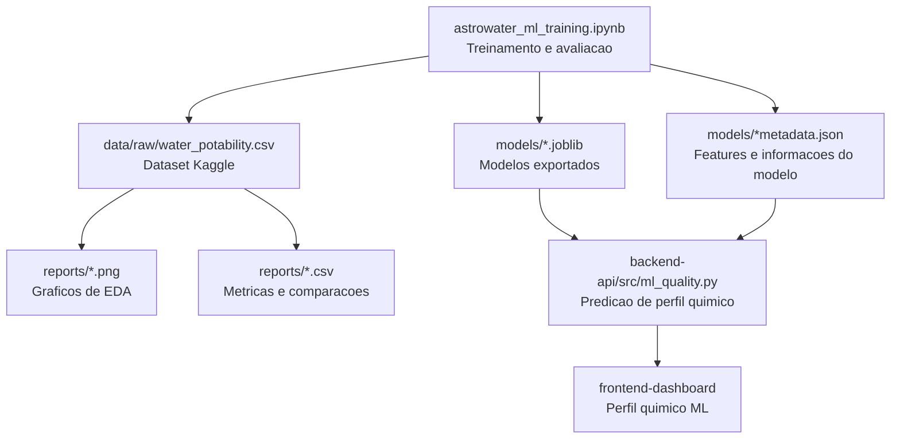
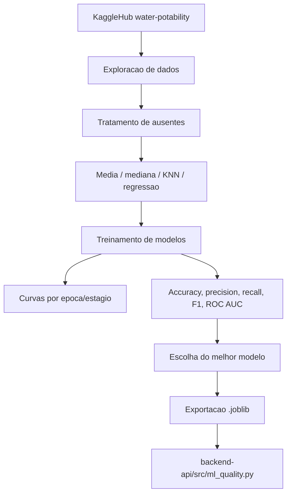

# Machine Learning - AstroWater AI

Este modulo treina modelos supervisionados para prever potabilidade da agua usando o dataset publico `adityakadiwal/water-potability`, baixado via `kagglehub`.

## Estrutura da pasta

```text
machine-learning/
├── README.md
├── astrowater_ml_training.ipynb
├── requirements.txt
├── data/
│   └── raw/
│       └── water_potability.csv
├── models/
│   ├── astrowater_best_epoch_model.joblib
│   ├── astrowater_potability_model.joblib
│   └── astrowater_potability_model_metadata.json
└── reports/
    ├── all_confusion_matrices.png
    ├── best_model_confusion_matrix.png
    ├── boxplots_by_potability.png
    ├── classification_reports_by_model.csv
    ├── correlation_heatmap.png
    ├── cross_validation_results.csv
    ├── epoch_training_curves.csv
    ├── epoch_training_curves.png
    ├── feature_distributions.png
    ├── feature_importance.csv
    ├── final_f1_ranking.png
    ├── final_model_comparison.csv
    ├── final_model_comparison.png
    ├── imputation_comparison.csv
    ├── imputation_comparison.png
    ├── missing_values_heatmap.png
    ├── missing_values_percent.png
    ├── model_comparison.png
    ├── pairplot_selected_features.png
    ├── target_distribution.png
    └── test_results.csv
```

### Arquivos da raiz

| Arquivo | Resumo |
| --- | --- |
| `README.md` | Documentacao do modulo de Machine Learning tabular, explicando objetivo, parametros, execucao, artefatos e uso no backend. |
| `astrowater_ml_training.ipynb` | Notebook principal. Baixa o dataset pelo KaggleHub, faz EDA, trata ausentes, treina modelos, compara metricas e exporta o modelo final. |
| `requirements.txt` | Dependencias Python usadas no notebook, incluindo `kagglehub`, `pandas`, `scikit-learn`, `xgboost`, `matplotlib`, `seaborn` e `joblib`. |

### Pastas e artefatos gerados

| Pasta/arquivo | Resumo |
| --- | --- |
| `data/raw/water_potability.csv` | Dataset publico de potabilidade da agua baixado pelo `kagglehub`. E a base de treino e avaliacao do modelo tabular. |
| `models/astrowater_potability_model.joblib` | Pipeline final salvo para uso pelo backend. Inclui preprocessing e classificador treinado. |
| `models/astrowater_best_epoch_model.joblib` | Melhor modelo encontrado na etapa de treinamento iterativo por epocas/estagios. |
| `models/astrowater_potability_model_metadata.json` | Metadados do modelo exportado, como features esperadas, nome do modelo e informacoes necessarias para integracao. |
| `reports/*.png` | Graficos de exploracao, comparacao de modelos, imputacao, matrizes de confusao, curvas de treino e importancia de variaveis. |
| `reports/*.csv` | Tabelas de resultados usadas para justificar tecnicamente a escolha do modelo. |

### Principais secoes do notebook

| Secao | O que faz |
| --- | --- |
| `1. Download do dataset com KaggleHub` | Baixa a versao mais recente do dataset `adityakadiwal/water-potability` e copia o CSV para `data/raw`. |
| `2. Analise exploratoria rapida` | Verifica formato dos dados, estatisticas, valores ausentes, distribuicoes, outliers, correlacoes e balanceamento da classe alvo. |
| `3. Preparacao e tratamento dos dados` | Compara estrategias de imputacao, como media, mediana, KNN e regressao linear iterativa. |
| `4. Treinamento de varios modelos` | Treina modelos classicos supervisionados para comparar desempenho com validacao e metricas consistentes. |
| `5. Avaliacao no conjunto de teste` | Avalia os modelos em dados separados desde o inicio, usando accuracy, precision, recall, F1, ROC AUC e matriz de confusao. |
| `6. Treinamento iterativo ate 2000 epocas` | Acompanha evolucao de modelos compativeis com treino incremental ou por estagios, como MLP, SGD e Gradient Boosting. |
| `7. Importancia das variaveis` | Mostra quais parametros quimicos mais influenciam a decisao do modelo escolhido. |
| `8. Comparacao final entre todos os modelos` | Consolida modelos classicos e iterativos para escolher o melhor candidato para integracao. |
| `9. Salvamento do melhor modelo` | Exporta o pipeline final em `.joblib` e salva metadados para o backend. |
| `10. Exemplo de predicao para integrar com backend` | Simula uma entrada parecida com o payload do ESP32/Wokwi e demonstra a chamada de predicao. |

### Como os arquivos se conectam



## Objetivo

Complementar o motor de regras e a visao computacional do AstroWater AI com um modelo tabular de Machine Learning. O modelo recebe variaveis fisico-quimicas da agua e retorna uma previsao de potabilidade.

## Diagrama do pipeline de ML



## Parametros usados pelo backend

| Campo | Origem na POC | Uso |
| --- | --- | --- |
| `ph` | Potenciometro pH do Wokwi | Acidez/alcalinidade. |
| `Hardness` | Potenciometro Hardness | Dureza/minerais dissolvidos. |
| `Solids` | Potenciometro Solids | Solidos dissolvidos totais. |
| `Chloramines` | Potenciometro Chloramines | Tratamento/desinfeccao. |
| `Sulfate` | Potenciometro Sulfate | Sulfatos simulados. |
| `Conductivity` | Potenciometro Conductivity | Condutividade eletrica. |
| `Organic_carbon` | Potenciometro Organic Carbon | Carbono organico total. |
| `Trihalomethanes` | Potenciometro Trihalomethanes | Subprodutos de desinfeccao. |
| `Turbidity` | Potenciometro Turbidity | Turbidez na escala do dataset. |

## Como executar

```powershell
cd machine-learning
python -m venv .venv
.venv\Scripts\Activate.ps1
pip install -r requirements.txt
jupyter notebook
```

Abra o notebook:

```text
astrowater_ml_training.ipynb
```

## Artefatos gerados

Ao executar o notebook, os arquivos sao gerados em:

- `data/raw`: dataset baixado pelo KaggleHub.
- `models`: melhor modelo treinado em formato `.joblib`.
- `reports`: metricas comparativas em `.csv` e graficos de exploracao, imputacao, treino e avaliacao.

## O que o notebook cobre

- Exploracao de dados: tipos, estatisticas, ausentes, distribuicoes, outliers, correlacoes e balanceamento da classe alvo.
- Tratamento de dados: comparacao entre media, mediana, KNN e imputacao iterativa por regressao linear.
- Treinamento: comparacao entre varios modelos classicos.
- Treinamento iterativo: curvas de ate 200 epocas/estagios para modelos compativeis.
- Avaliacao: acuracia, precision, recall, F1, ROC AUC, matriz de confusao e importancia de variaveis.

## Observacao de seguranca

O modelo e uma POC educacional para triagem e nao substitui analise laboratorial oficial de potabilidade.
