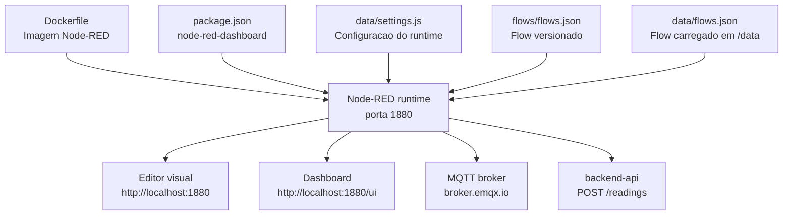
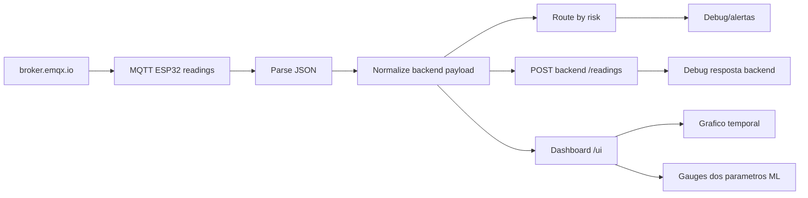

# node-red

Modulo de automacao visual do AstroWater AI.

## Estrutura da pasta

```text
node-red/
├── README.md
├── Dockerfile
├── package.json
├── flows/
│   └── flows.json
└── data/
    ├── flows.json
    ├── package.json
    └── settings.js
```

### Arquivos da raiz

| Arquivo | Resumo |
| --- | --- |
| `README.md` | Documentacao do modulo Node-RED, explicando objetivo, responsabilidades, execucao, dashboard `/ui` e demonstracao. |
| `Dockerfile` | Define a imagem do Node-RED usada no Docker Compose. Instala dependencias em `/data`, copia o flow versionado e define `FLOWS=flows.json`. |
| `package.json` | Lista dependencias do modulo, principalmente `node-red-dashboard`, usado para gauges, graficos e painel visual em `/ui`. |

### Pasta `flows`

| Arquivo | Resumo |
| --- | --- |
| `flows/flows.json` | Flow versionado e principal do projeto. Contem o MQTT input, parser JSON, normalizacao do payload, roteamento por risco, POST para o backend e widgets do dashboard. |

### Pasta `data`

| Arquivo | Resumo |
| --- | --- |
| `data/flows.json` | Copia do flow usado pelo runtime do Node-RED dentro do diretorio `/data`. Serve para o container iniciar ja com a automacao pronta. |
| `data/package.json` | Metadados internos do projeto Node-RED gerados/esperados pelo runtime. |
| `data/settings.js` | Configuracao do Node-RED. Define `flowFile`, porta `1880`, logs, reconexao MQTT, suporte a modulos externos e comportamento do editor. |

### Principais blocos do flow

| No Node-RED | Tipo | O que faz |
| --- | --- | --- |
| `MQTT ESP32 readings` | `mqtt in` | Assina o topico `fiap/astrowater/readings` no broker `broker.emqx.io` e recebe leituras do ESP32/Wokwi. |
| `Parse JSON` | `json` | Converte o texto recebido via MQTT em objeto JSON para os proximos nos. |
| `Normalize backend payload` | `function` | Padroniza campos do Wokwi para o contrato esperado pelo backend, mantendo parametros de ML e valores ausentes como `null`. |
| `Build /ui metrics` | `function` | Prepara os valores para gauges, graficos e tabela do dashboard Node-RED. |
| `Route by risk` | `switch` | Separa leituras por risco (`verde`, `amarelo`, `laranja`, `vermelho`) para facilitar debug e demonstracao. |
| `POST backend /readings` | `http request` | Envia a leitura normalizada para `http://backend-api:8000/readings`. |
| `raw mqtt` | `debug` | Exibe o payload bruto recebido do broker. |
| `payload normalizado com ML` | `debug` | Exibe o payload final com todos os parametros enviados ao backend. |
| `ALERTA CRITICO`, `Atencao`, `Leitura normal` | `debug` | Mostram no painel de debug qual caminho de risco foi acionado. |
| `backend response` | `debug` | Mostra a resposta da API apos salvar/processar a leitura. |
| `Exemplo verde` | `inject` | Gera uma leitura simulada segura para testar o flow sem abrir o Wokwi. |
| `Exemplo vermelho` | `inject` | Gera uma leitura simulada critica para testar alertas e roteamento. |

### Como os arquivos se conectam



## Responsabilidades

- Assinar o topico MQTT `fiap/astrowater/readings` no broker publico `broker.emqx.io`.
- Receber as leituras enviadas pelo ESP32/Wokwi.
- Normalizar o payload para o formato aceito pelo backend.
- Separar leituras por nivel de risco (`verde`, `amarelo`, `laranja`, `vermelho`).
- Encaminhar as leituras para `POST /readings` no `backend-api`.
- Mostrar logs e alertas no painel de debug do Node-RED.
- Exibir graficos e gauges em `http://localhost:1880/ui`.

## Arquivos

- `Dockerfile`: imagem do modulo Node-RED.
- `flows/flows.json`: fluxo versionado usado na demonstracao.
- `package.json`: metadados do modulo.
- `data/.gitkeep`: pasta usada pelo container para configuracoes locais, credenciais e arquivos gerados pelo Node-RED.

## Execucao com Docker Compose

Na raiz do projeto:

```bash
docker compose up --build node-red
```

Depois acesse:

```text
http://localhost:1880
```

Dashboard visual:

```text
http://localhost:1880/ui
```

## Fluxo principal



## Payload normalizado

O flow preserva os dados originais em `raw`, mas envia ao backend os campos principais:

- `deviceId`
- `community`
- `ph`
- `turbidity`
- `temperature`
- `Hardness`
- `Solids`
- `Chloramines`
- `Sulfate`
- `Conductivity`
- `Organic_carbon`
- `Trihalomethanes`
- `Turbidity`
- `edgeRisk`
- `networkSwitch`

Campos ausentes do modelo de ML viram `null`, nao `0`. Isso evita alimentar o modelo com zeros falsos.

## Dashboard `/ui`

A rota `/ui` mostra todos os sensores/parametros que alimentam o modelo de Machine Learning:

- Grafico temporal com `pH`, turbidez operacional, temperatura, `Hardness`, `Solids`, `Chloramines`, `Sulfate`, `Conductivity`, `Organic_carbon`, `Trihalomethanes` e `Turbidity` do dataset de ML.
- Gauge de pH.
- Gauge de turbidez.
- Gauge de temperatura.
- Gauge de `Hardness`.
- Gauge de `Solids`.
- Gauge de `Chloramines`.
- Gauge de `Sulfate`.
- Gauge de `Conductivity`.
- Gauge de `Organic_carbon`.
- Gauge de `Trihalomethanes`.
- Gauge de `Turbidity` na escala do dataset de ML.
- Texto com comunidade, risco atual, status do switch de rede e horario da ultima leitura.

O dashboard usa o pacote `node-red-dashboard`, instalado pela imagem Docker do modulo.

## Como demonstrar

1. Suba o backend e o Node-RED com Docker Compose.
2. Abra `http://localhost:1880`.
3. Abra `http://localhost:1880/ui`.
4. Abra tambem o painel de debug do Node-RED.
5. Rode o Wokwi com `ENABLE_MQTT = true`.
6. Deixe o slide switch de WiFi em `ON`.
7. Veja as leituras chegando pelo MQTT, alimentando os graficos e sendo encaminhadas para o backend.
8. Coloque o slide switch em `OFF` no Wokwi para mostrar o cache local do ESP32 crescendo.
9. Volte o switch para `ON` para ver a fila ser sincronizada e as leituras aparecerem no Node-RED.

## Testes manuais

O fluxo inclui dois injects:

- `Exemplo verde`: simula uma leitura segura.
- `Exemplo vermelho`: simula uma leitura critica.

Eles permitem validar o roteamento por risco mesmo sem o Wokwi aberto.

## Observacoes

O broker `broker.emqx.io` e publico, entao o topico e tratado apenas como ambiente de demonstracao. Para evitar conflito com outros grupos, altere o topico no Wokwi e no node MQTT do Node-RED para algo mais especifico, por exemplo:

```text
fiap/astrowater/grupo-felipe/readings
```
