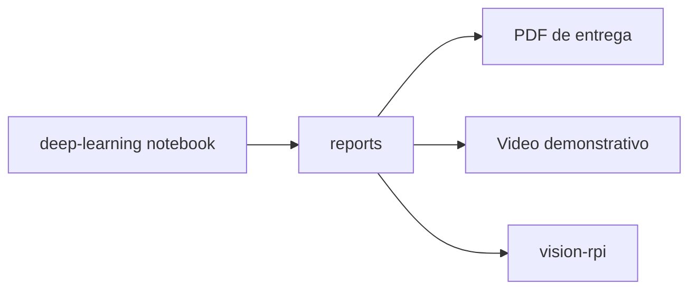

# reports

Relatorios e artefatos gerados pelos experimentos de dados e visao computacional.

## Arquivos atuais

- `classification_splits.csv`: divisao das imagens em treino, validacao e teste.
- `class_name_map.json`: mapeamento entre nomes seguros de classes e nomes originais.
- `image_metadata.csv`: metadados das imagens analisadas.
- `dataset_classification_overview.png`: grafico de distribuicao/visao geral do dataset.

## Relacao com os modulos

