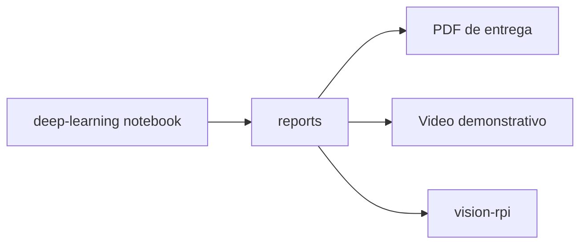

# reports

Relatorios e artefatos gerados pelos experimentos de dados e visao computacional.

## Visao para avaliacao

Esta pasta concentra evidencias produzidas pelos notebooks, principalmente relacionadas ao dataset visual de residuos em agua superficial. Ela ajuda a demonstrar que o grupo nao apenas implementou a POC, mas tambem explorou dados, separou conjuntos e produziu graficos/arquivos de apoio.

## Arquivos atuais

- `classification_splits.csv`: divisao das imagens em treino, validacao e teste.
- `class_name_map.json`: mapeamento entre nomes seguros de classes e nomes originais.
- `image_metadata.csv`: metadados das imagens analisadas.
- `dataset_classification_overview.png`: grafico de distribuicao/visao geral do dataset.

## Relacao com os modulos

## Como usar na entrega

- Inserir graficos no PDF para evidenciar exploracao de dados.
- Citar `classification_splits.csv` para explicar separacao treino/validacao/teste.
- Usar `dataset_classification_overview.png` como print visual no documento.
- Explicar que os artefatos apoiam a selecao do modelo visual usado no Raspberry Pi.
