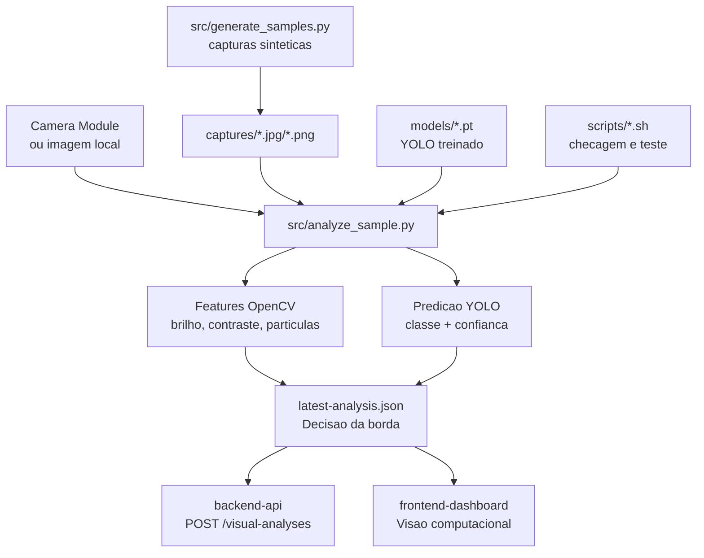
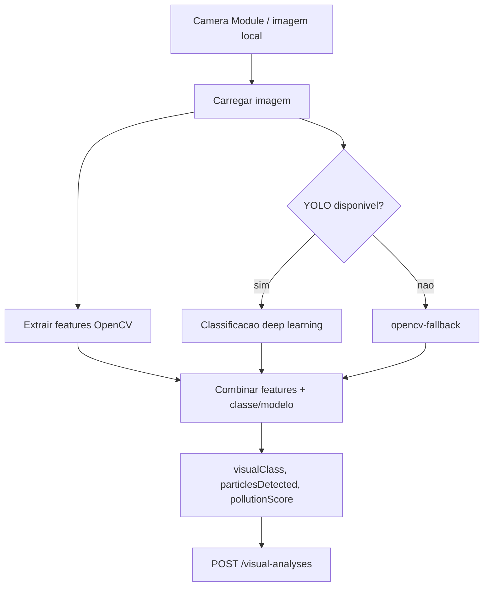

# vision-rpi

Modulo de visao computacional para Raspberry Pi 3B com Camera Module.

## Estrutura da pasta

```text
vision-rpi/
├── README.md
├── Dockerfile
├── requirements.txt
├── requirements-rpi-model.txt
├── requirements-rpi-opencv.txt
├── captures/
│   ├── README.md
│   ├── latest.jpg
│   ├── latest-analysis.json
│   └── samples/
│       ├── amarelada.png
│       ├── azulada.png
│       ├── com_sedimentos.png
│       ├── limpa.png
│       ├── transparente.png
│       └── turva.png
├── models/
│   ├── astrowater_yolov8n_cls_best.pt
│   ├── astrowater_yolov8s_cls_best.pt
│   └── class_name_map.json
├── scripts/
│   ├── check_rpi_capacity.sh
│   └── run_edge_test.sh
└── src/
    ├── __init__.py
    ├── analyze_sample.py
    └── generate_samples.py
```

### Arquivos da raiz

| Arquivo | Resumo |
| --- | --- |
| `README.md` | Documentacao do modulo de visao computacional em borda, com comandos para Raspberry Pi, camera, modelo YOLO, OpenCV e envio ao backend. |
| `Dockerfile` | Imagem Python de referencia para executar o modulo em container quando nao houver necessidade de camera fisica direta. |
| `requirements.txt` | Dependencias completas para execucao com OpenCV, `requests` e Ultralytics/YOLO. |
| `requirements-rpi-model.txt` | Dependencias para tentar rodar o modelo no Raspberry Pi, incluindo `ultralytics`. |
| `requirements-rpi-opencv.txt` | Dependencias leves para o modo OpenCV, usado quando o Raspberry Pi 3B nao suporta PyTorch/Ultralytics com estabilidade. |

### Pasta `src`

| Arquivo | Resumo |
| --- | --- |
| `src/__init__.py` | Marca `src` como pacote Python, permitindo organizacao modular do codigo. |
| `src/analyze_sample.py` | Script principal da borda. Carrega/captura imagem, extrai features OpenCV, tenta usar YOLO, calcula decisao visual e envia o JSON para o backend. |
| `src/generate_samples.py` | Gera imagens sinteticas de agua para testes locais das classes visuais (`transparente`, `limpa`, `turva`, `amarelada`, `azulada`, `com sedimentos`). |

### Classes e estruturas principais em `analyze_sample.py`

| Classe/estrutura | O que representa |
| --- | --- |
| `VisualFeatures` | Pacote de features extraidas por OpenCV: brilho, saturacao, matiz, contraste, particulas, turbidez visual, cor dominante e classe visual estimada. |
| `DeepLearningPrediction` | Resultado do modelo YOLO: nome do modelo, classe prevista, confianca e score visual de poluicao associado. |

### Funcoes principais em `analyze_sample.py`

| Funcao | Resumo |
| --- | --- |
| `capture_with_libcamera` | Captura uma foto pela camera do Raspberry usando comando de sistema e salva no caminho indicado. |
| `load_image` | Carrega a imagem com OpenCV e valida se o arquivo existe/foi lido corretamente. |
| `water_sample_crop` | Seleciona a regiao analisada da imagem, reduzindo ruido de bordas/cenario. |
| `center_crop` | Faz recorte central proporcional para focar na amostra. |
| `estimate_particles` | Estima quantidade de particulas/sedimentos a partir de bordas, brilho e mascara visual. |
| `color_name` | Converte matiz/saturacao/brilho em uma cor dominante amigavel para o dashboard. |
| `classify_visual` | Classifica a amostra por heuristica OpenCV: limpa, turva, amarelada, azulada ou com sedimentos. |
| `map_model_class_to_visual_class` | Traduz classes do YOLO treinado no dataset de residuos para classes visuais usadas pelo backend. |
| `pollution_score_for_model_class` | Calcula um score de poluicao visual baseado na classe prevista e na confianca do modelo. |
| `run_deep_learning_model` | Tenta carregar e executar o modelo YOLO localmente; se falhar, permite seguir com fallback OpenCV. |
| `analyze_image` | Executa o pipeline OpenCV completo e retorna `VisualFeatures`. |
| `build_payload` | Monta o JSON final com decisao de borda, features, predicao do modelo, benchmark e metadados. |
| `save_payload` | Salva o JSON da analise em arquivo local para auditoria e demonstracao. |
| `post_to_backend` | Envia o resultado visual para a API em `POST /visual-analyses`. |
| `parse_args` | Define os argumentos de linha de comando, como imagem, captura, backend, modelo e benchmark. |
| `main` | Orquestra captura/carregamento, analise, benchmark, persistencia local e envio ao backend. |

### Funcoes principais em `generate_samples.py`

| Funcao | Resumo |
| --- | --- |
| `add_sediments` | Desenha particulas artificiais sobre a imagem para simular sedimentos visiveis. |
| `make_sample` | Cria uma imagem sintetica de amostra de agua com cor base e textura simples. |
| `main` | Gera os arquivos de exemplo em `captures/samples`. |

### Pasta `models`

| Arquivo | Resumo |
| --- | --- |
| `models/astrowater_yolov8s_cls_best.pt` | Peso YOLOv8s classificador treinado no modulo `deep-learning`; maior e mais custoso, mas com melhor capacidade. |
| `models/astrowater_yolov8n_cls_best.pt` | Peso YOLOv8n classificador, menor e mais adequado para testes em hardware limitado. |
| `models/class_name_map.json` | Mapeamento entre nomes seguros de classes e nomes originais do dataset/modelo. |

### Pasta `captures`

| Arquivo/pasta | Resumo |
| --- | --- |
| `captures/README.md` | Orienta que a pasta guarda imagens capturadas para testes locais e que arquivos grandes devem ser evitados no Git. |
| `captures/latest.jpg` | Ultima imagem capturada/testada no Raspberry Pi. E usada como entrada para `analyze_sample.py`. |
| `captures/latest-analysis.json` | Ultimo resultado de analise gerado pela borda, incluindo classe visual, score, particulas, modelo e tempo de processamento. |
| `captures/samples/*.png` | Amostras sinteticas usadas para testar rapidamente as classes visuais sem camera fisica. |

### Pasta `scripts`

| Arquivo | Resumo |
| --- | --- |
| `scripts/check_rpi_capacity.sh` | Verifica disco, memoria, versao do Python/pip e recomenda se o Raspberry tem espaco para tentar instalar Ultralytics/Torch. |
| `scripts/run_edge_test.sh` | Executa um teste completo de borda: usa `captures/latest.jpg` se existir ou captura uma nova imagem, gera JSON e envia ao backend se `BACKEND_URL` estiver definido. |

### Como os arquivos se conectam



## Diagrama da decisao na borda



## Classes visuais usadas no backend

| Classe | Prioridade esperada | Interpretacao |
| --- | --- | --- |
| `transparente` | Verde | Amostra sem indicio visual critico. |
| `limpa` | Verde | Aspecto visual adequado para triagem. |
| `azulada` | Amarelo | Coloracao incomum; recomenda nova verificacao. |
| `turva` | Laranja | Turbidez ou suspensao visual suspeita. |
| `amarelada` | Laranja | Coloracao suspeita. |
| `com sedimentos` | Vermelho | Sedimentos visiveis elevam a prioridade. |

Observacao: o Dockerfile documenta dependencias, mas o acesso a camera fisica pode ser mais simples rodando o script direto no Raspberry Pi.

## Teste no Raspberry Pi 3B sem Docker

O Raspberry Pi atua como no de borda: captura/processa a imagem, executa o modelo localmente quando possivel, decide a classe visual e so depois envia o JSON ao backend.

### Passo a passo executado no Raspberry Pi

Entre na pasta do modulo:

```bash
cd ~/projeto_fiap/vision-rpi
```

Remova ambiente antigo e cache para evitar erro de espaco/RAM durante instalacao:

```bash
rm -rf .venv
rm -rf ~/.cache/pip
pip cache purge
sudo apt clean
```

Crie e ative o ambiente:

```bash
python3 -m venv .venv
source .venv/bin/activate
```

Instale dependencias do modo com modelo:

```bash
pip install --upgrade pip
pip install --no-cache-dir -r requirements-rpi-model.txt
```

Se o Raspberry travar por RAM, crie swap temporario antes de instalar:

```bash
sudo fallocate -l 2G /swapfile
sudo chmod 600 /swapfile
sudo mkswap /swapfile
sudo swapon /swapfile
free -h
```

Depois da instalacao/teste, a swap pode ser removida:

```bash
sudo swapoff /swapfile
sudo rm /swapfile
```

### Checar câmera e capturar foto

O script usa captura automatica, mas no Raspberry testado o comando `libcamera-still` nao existia. Por isso, primeiro verifique quais comandos existem:

```bash
which rpicam-still
which libcamera-still
which raspistill
```

Crie a pasta de capturas:

```bash
mkdir -p captures
```

Se existir `rpicam-still`, capture assim:

```bash
rpicam-still --timeout 3000 -o captures/latest.jpg
```

Se existir `raspistill`, capture assim:

```bash
raspistill -t 3000 -o captures/latest.jpg
```

Valide se a imagem foi criada:

```bash
ls -lh captures/latest.jpg
file captures/latest.jpg
```

### Rodar análise na borda e enviar ao backend

Com a foto salva em `captures/latest.jpg`, rode:

```bash
python src/analyze_sample.py \
  --image captures/latest.jpg \
  --community-id 1 \
  --backend-url http://192.168.1.63:8000 \
  --save-json captures/latest-analysis.json \
  --benchmark-runs 1
```

Para testar o modelo aceitando confianca mais baixa na demonstracao do Raspberry Pi 3B:

```bash
python src/analyze_sample.py \
  --image captures/latest.jpg \
  --community-id 1 \
  --backend-url http://192.168.1.63:8000 \
  --save-json captures/latest-analysis.json \
  --benchmark-runs 1 \
  --confidence-threshold 0.30
```

No JSON gerado, observar:

- `visualClass`: decisao final tomada na borda.
- `modelClass`: classe prevista pelo YOLO.
- `modelConfidence`: confianca do YOLO.
- `features.analysis_mode`: `deep-learning` ou `opencv-fallback`.
- `edgeDecision.totalProcessingMs`: tempo total de processamento no Pi.
- `edgeDecision.sentToBackendAfterDecision`: confirma que enviou ao servidor apos decidir.

### Instalacao base do Raspberry Pi OS

No Raspberry Pi OS 64-bit, se estiver faltando pacote de sistema:

```bash
sudo apt update
sudo apt install -y python3-venv python3-pip libgl1 libglib2.0-0
```

Antes de instalar o modelo, cheque a capacidade do Pi:

```bash
bash scripts/check_rpi_capacity.sh
```

O erro `No space left on device` geralmente acontece durante a instalacao do `torch`, que baixa centenas de MB e instalado ocupa mais de 1 GB. Para tentar de novo:

```bash
pip cache purge
sudo apt clean
rm -rf ~/.cache/pip
rm -rf .venv
python3 -m venv .venv
source .venv/bin/activate
pip install --upgrade pip
pip install --no-cache-dir -r requirements-rpi-model.txt
```

Se o `pip install` falhar por causa de espaco, PyTorch ou memoria no Raspberry Pi 3B, registre isso no PDF como limite real de hardware. Nesse caso, rode o modo OpenCV de borda, que ainda toma decisao local antes de enviar:

```bash
pip install --no-cache-dir -r requirements-rpi-opencv.txt
python src/analyze_sample.py \
  --capture \
  --output captures/latest.jpg \
  --community-id 1 \
  --backend-url http://192.168.0.10:8000 \
  --save-json captures/latest-analysis.json \
  --disable-deep-learning
```

### Rodar captura + decisao na borda

Substitua o IP pelo IP do computador onde o Docker Compose esta rodando:

```bash
python src/analyze_sample.py \
  --capture \
  --output captures/latest.jpg \
  --community-id 1 \
  --backend-url http://192.168.0.10:8000 \
  --save-json captures/latest-analysis.json \
  --benchmark-runs 3
```

O JSON salvo em `captures/latest-analysis.json` inclui:

- `visualClass`: decisao local antes de enviar ao servidor.
- `modelClass`: classe original prevista pelo YOLO.
- `modelConfidence`: confianca do modelo.
- `pollutionScore`: score visual de poluicao.
- `edgeDecision.totalProcessingMs`: tempo total no Raspberry.
- `edgeDecision.averageInferenceMs`: tempo medio de inferencia local.

## Modelo de deep learning

O peso padrao fica em:

```text
models/astrowater_yolov8s_cls_best.pt
```

Ele veio do notebook em `deep-learning` e foi escolhido porque teve a melhor comparacao entre os modelos treinados. O script tenta usar esse modelo automaticamente. Se o Ultralytics/PyTorch nao estiver disponivel, ele continua funcionando com OpenCV.

## Uso com imagem local

```bash
python src/analyze_sample.py --image captures/samples/turva.png --community-id 1
```

Forcar apenas OpenCV:

```bash
python src/analyze_sample.py --image captures/samples/turva.png --disable-deep-learning
```

Teste com benchmark local:

```bash
python src/analyze_sample.py --image captures/samples/turva.png --benchmark-runs 3 --save-json captures/test-analysis.json
```

## Uso com camera no Raspberry Pi

```bash
python src/analyze_sample.py --capture --output captures/latest.jpg --community-id 1
```

O comando usa `libcamera-still`, comum em Raspberry Pi OS mais recente.

## Enviar para o backend

```bash
python src/analyze_sample.py --image captures/latest.jpg --community-id 1 --backend-url http://localhost:8000
```

## Gerar amostras sinteticas

```bash
python src/generate_samples.py
```

Classes visuais geradas/testadas:

- `transparente`
- `azulada`
- `limpa`
- `turva`
- `amarelada`
- `com sedimentos`

## Saida JSON

```json
{
  "deviceId": "ASTRO-RPI-CAM-001",
  "communityId": 1,
  "imageName": "turva.png",
  "visualClass": "turva",
  "visualTurbidityScore": 61.4,
  "particlesDetected": 8,
  "dominantColor": "cinza claro",
  "modelName": "astrowater_yolov8s_cls_best",
  "modelClass": "Plastic Water Bottle",
  "modelConfidence": 0.91,
  "pollutionScore": 85.4,
  "source": "raspberry-pi-camera+yolov8s-cls"
}
```
